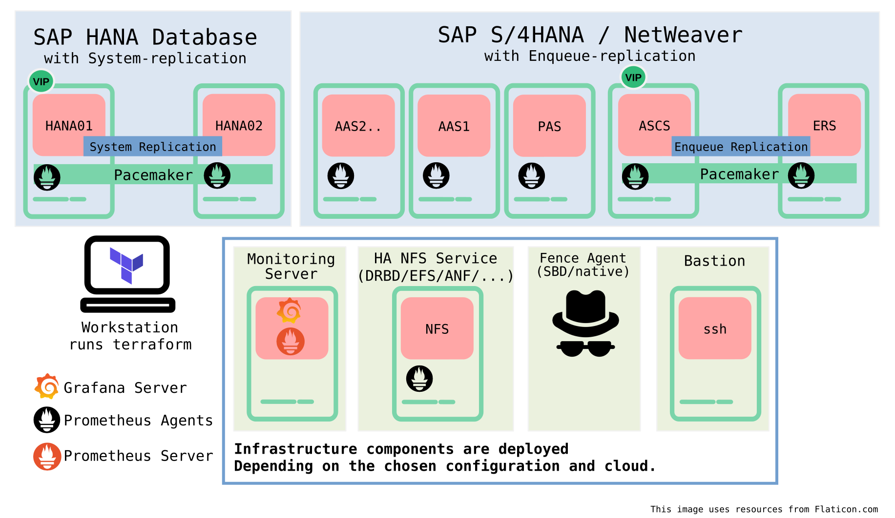
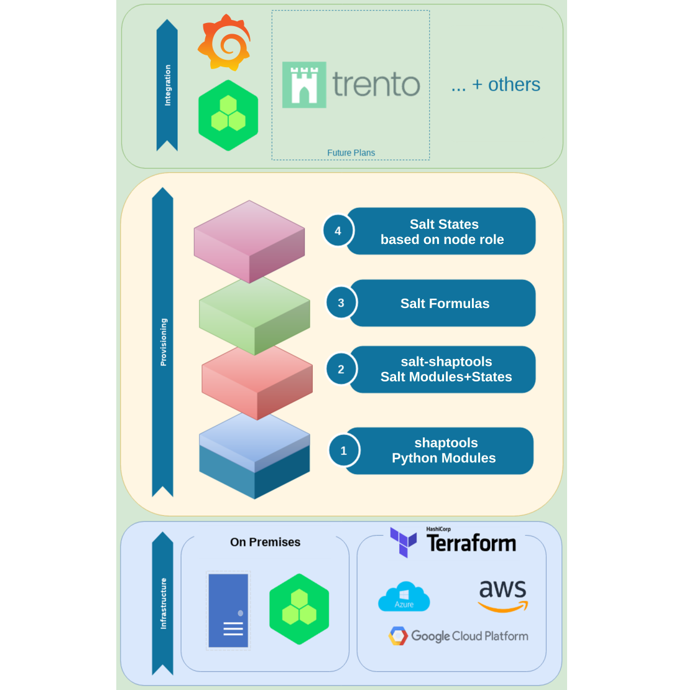
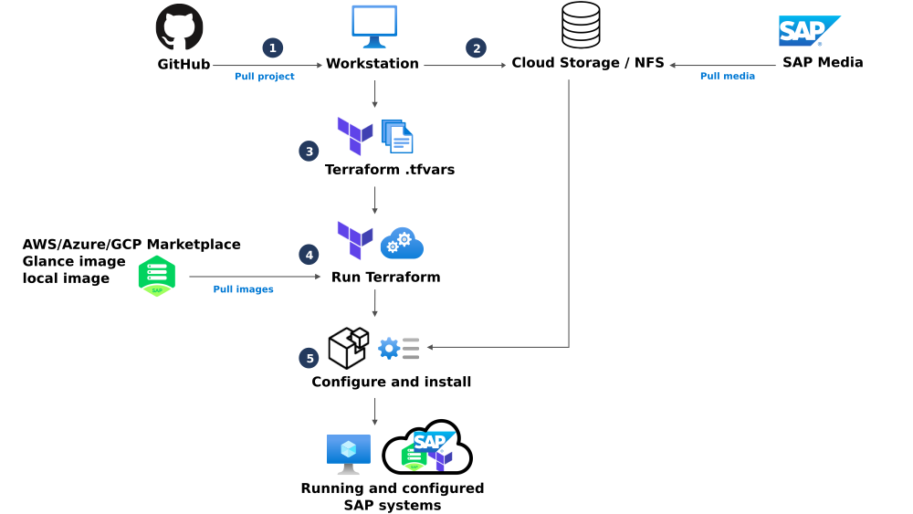

# Automated SAP/HA Deployments in Public and Private Clouds with Terraform

[](https://github.com/SUSE/ha-sap-terraform-deployments/actions)

**Supported terraform version  `1.1.X`**

* [About](#about)
* [Overview](#overview)
   * [Components Details](#components-details)
   * [Products](#products)
   * [Cloud Providers](#cloud-providers)
   * [Features](#features)
* [Project Structure](#project-structure)
* [Getting started](#getting-started)
* [Troubleshooting](#troubleshooting)

___

# About

This Project provides a high configurable way to deploy **SAP HANA**
database and **SAP S/4HANA** (or **SAP NetWeaver**) on various cloud platforms.

Both public cloud and private cloud scenarios are
possible. The major cloud providers _Google Cloud Platform_
(GCP), _Microsoft Azure_, and _Amazon Web Services_ (AWS) are
supported. Furthermore _OpenStack_ and _libvirt/KVM_ can be used.

It shall give an improved user experience for our SAP customers and partners.
and deployment will takes minutes/hours instead of days.
You can use it for POC or production deploymentes

Everything is powered by SUSE Linux Enterprise Server for SAP Applications.


# Overview



The diagram above shows components for an example setup. Several
features can be enabled or disabled through configuration options to
control the behavior of the HA Cluster, the SAP HANA and SAP S/4HANA
or SAP NetWeaver. The setup is also dependent on the cloud provider which is used.

## Components Details

 - **SAP HANA Database**:
   HANA might be deployed as a single SAP HANA database instance,
   or as a two-node configuration with system replication.
   Even HANA Scale-Out scenarios can be deployed, depending on the cloud provider (see _Features_ section).
   In addition a SUSE HA cluster can be set on top of that.
   Please also have a look at [Preparing SAP software](doc/sap_software.md)

 - **SAP S/4 HANA (or NetWeaver)**:
   S/4HANA can be deployed with a single PAS instance or as
   a full stack including ASCS, ERS, PAS and AAS (multiple) instances.
   In the latter sce case, a SUSE HA cluster is set on top of ASCS/ERS.
   For more information see [S/4HANA and NetWeaver](doc/netweaver.md) and [Preparing SAP software](doc/sap_software.md).

 - **ISCSI server**:
   This provides Stonith Block Devices used by the
   _sbd fencing_ mechanism. Also see [Fencing mechanism](doc/fencing.md)
   _Native fencing_ mechanisms are available for some cloud environments (see _Features_ section).

 - **Monitoring server**:
   The monitoring solution is based on [prometheus🔗](https://prometheus.io) and
   [grafana🔗](https://grafana.com/).
   It provides informative and customizable dashboards to users and administrators.
   Every node has prometheus exporters installed which are used to collect the needed metrics.
   For more information see [Monitoring of cluster](doc/monitoring.md).

 - **DRBD cluster**:
   It is used to provide a highly available NFS server for cloud providers that lack a native solution.
   It will be used to mount SAP NetWeaver shared files.
   For more information see [DRBD](doc/drbd.md).
   Some cloud providers have native solutions for high available NFS (see _Features_ section),
   which should be preferred over the DRBD solution.

 - **Bastion server**:
   A bastion server is used to have a single internet-facing entry point (`ssh`) for the administrator and the provisioning process.
   Security-wise, it is a best practice to access you machines this way.
   The availability of this solution depends again on the used cloud provider (see _Features_ section).

For more on various topics have a look on the following documentation:

   - [SUSE saptune](doc/saptune.md)

## Products

This repository supports deployment with following products:

| Vendor      | Product                                                  |
| ----------- | -------------------------------------------------------- |
| SUSE        | SUSE Linux Enterprise Server for SAP Applications 12 SP5 <br> Certification: [SLES for SAP🔗](https://www.suse.com/products/sles-for-sap/) and [SAP Process Automation🔗](https://store.sap.com/dcp/en/product/display-0000059520_live_v1/SUSE%20Linux%20Enterprise%20Server%20for%20SAP%20applications)  |
| SUSE        | SUSE Linux Enterprise Server for SAP Applications 15 SP4 (or older)<br> Certification: [SLES for SAP🔗](https://www.suse.com/products/sles-for-sap/) and [SAP Process Automation🔗](https://store.sap.com/dcp/en/product/display-0000059520_live_v1/SUSE%20Linux%20Enterprise%20Server%20for%20SAP%20applications)  |
| SAP         | SAP HANA 2.0 with SPS >= 02   |
| SAP         | SAP NETWEAVER 7.5 (and later) |
| SAP         | SAP S/4HANA 1610              |
| SAP         | SAP S/4HANA 1709              |
| SAP         | SAP S/4HANA 1809              |
| SAP         | SAP S/4HANA 1909              |
| SAP         | SAP S/4HANA 2020              |
| SAP         | SAP S/4HANA 2021              |


## Cloud Providers

This repository supports deployment on the following SAP certified providers cloud providers:

| Vendor      | Product                                                  | Certification                     |
| ----------- | -------------------------------------------------------- | --------------------------------- |
| Amazon      | Amazon Web Services (AWS)                                | [SAP Hardware Directory for AWS🔗](https://www.sap.com/dmc/exp/2014-09-02-hana-hardware/enEN/#/solutions?filters=ve:23)  |
| Microsoft   | Azure                                                    | [SAP Hardware Directory for Azure🔗](https://www.sap.com/dmc/exp/2014-09-02-hana-hardware/enEN/#/solutions?filters=ve:24)  |
| Google      | Google Cloud Platform (GCP)                              | [SAP Hardware Directory for GCP🔗](https://www.sap.com/dmc/exp/2014-09-02-hana-hardware/enEN/#/solutions?filters=ve:29)  |
| OpenInfra   | OpenStack                                                | Depends on deployed hardware, <br> get an overview in [SAP's Hardware Directory🔗](https://www.sap.com/dmc/exp/2014-09-02-hana-hardware/enEN/#/solutions)     |
| libvirt.org | Libvirt                                                  | not certified                     |

## Features

The following features are implemented:

| Feature | AWS   | Azure | GCP   | OpenStack | Libvirt |
| :------ | :---: | :---: | :---: | :-------: | :-----: |
| **SUSE saptune / SAP sapnotes** <br> SUSE's saptune is applied with the correct solution template to configure the systems based on SAP sapnotes recommendations. <br> For additional information see [Tuning Systems with saptune🔗](https://documentation.suse.com/sles-sap/15-SP3/html/SLES-SAP-guide/cha-tune.html). | ☒     | ☒     | ☒     | ☒         | ☒       |
| **HANA single node** <br> Deployment of HANA on a single node. <br> For additional information see [SAP Hardware Directory for AWS🔗](https://www.sap.com/dmc/exp/2014-09-02-hana-hardware/enEN/#/solutions?filters=ve:23) | ☒     | ☒     | ☒     | ☒         | ☒       |
| **HANA Scale-Up - performance optimized** <br> Deployment of HANA with system replication in a performance optimized setup. <br> For addition information see [SAP HANA System Replication Scale-Up - Performance Optimized Scenario🔗](https://documentation.suse.com/sbp/all/single-html/SLES4SAP-hana-sr-guide-PerfOpt-15/). | ☒     | ☒     | ☒     | ☒         | ☒       |
| **HANA Scale-Up - cost optimized** <br> Deployment of HANA with system replication in a cost optimized (additional tenant DB) setup. <br> For additional information see [SAP HANA System Replication Scale-Up - Cost Optimized Scenario🔗](https://documentation.suse.com/sbp/all/html/SLES4SAP-hana-sr-guide-costopt-15/).  | ☒     | ☒     | ☒     | ☒         | ☒       |
| **HANA Scale-Out - performance optimized** <br> Deployment of HANA Scale-Out (multi node) with system replication in a performance optimized setup. <br> For additional information see [SAP HANA System Replication Scale-Out - Performance Optimized Scenario🔗](https://documentation.suse.com/sbp/all/html/SLES4SAP-hana-sr-guide-costopt-15/) and [SAP HANA System Replication Scale-Out High Availability in Amazon Web Services🔗](https://documentation.suse.com/sbp/all/html/SLES-SAP-hana-scaleOut-PerfOpt-12-AWS/).  | ☒ | ☒ | ☒ | ☒ | ☒ |
| **HANA Scale-Out - with standby nodes (HANA Host-Auto-Failover)** <br> Deployment of HANA Scale-Out (multi node) with system replication and Host-Auto-Failover via standby nodes. <br> For additional information see [Setting Up Host Auto-Failover🔗](https://help.sap.com/docs/SAP_HANA_PLATFORM/6b94445c94ae495c83a19646e7c3fd56/879d9dc46bb64ccda028872c86c70afc.html?version=2.0.05) and [Azure: Deploy a SAP HANA scale-out system with standby node on Azure VMs by using Azure NetApp Files on SUSE Linux Enterprise Server🔗](https://docs.microsoft.com/en-us/azure/virtual-machines/workloads/sap/sap-hana-scale-out-standby-netapp-files-suse). | 🚫 | ☒     | 🚫    | ☒         | ☐      |
| **SAP S/4HANA ENSA 1** <br> Deployment of a SAP S/4HANA in Enqueue Replication (ENSA) 1 scenario. <br> For additional information see [SAP NetWeaver Enqueue Replication 1 High Availability Cluster - Setup Guide for SAP NetWeaver 7.40 and 7.50 🔗](https://documentation.suse.com/sbp/all/html/SAP-nw740-sle15-setupguide/). | ☒     | ☒     | ☒     | ☒         | ☒       |
| **SAP S/4HANA ENSA 2** <br> Deployment of a S/4HANA in Enqueue Replication (ENSA) 2 scenario. <br> For additional information see [SAP S/4HANA - Enqueue Replication 2 High Availability Cluster - Setup Guide 🔗](https://documentation.suse.com/sbp/all/html/SAP-S4HA10-setupguide-sle15/index.html). | ☒     | ☒     | ☒     | ☒         | ☒       |
| **SAP S/4HANA single PAS** <br> Deployment of a single S/4HANA PAS (primary instance). <br> For additional information see [SAP S/4HANA - Enqueue Replication 2 High Availability Cluster - Setup Guide 🔗](https://documentation.suse.com/sbp/all/html/SAP-S4HA10-setupguide-sle15/index.html). | ☒     | ☒     | ☒     | ☒         | ☒       |
| **SAP S/4HANA High Availability Cluster** <br> Deployment of a full SAP S/4HANA stack including ASCS, ERS, PAS and AAS (multiple) instances. <br> For additional information see [SAP S/4HANA - Enqueue Replication 2 High Availability Cluster - Setup Guide 🔗](https://documentation.suse.com/sbp/all/html/SAP-S4HA10-setupguide-sle15/index.html). | ☒     | ☒     | ☒     | ☒         | ☒       |
| **Deployment in different Availability Zones/Sets** <br> Deployment of virtual instances in different Availability Zones/Sets for HA on hardware level. | ☒     | ☒     | ☒     | ☐        | ☐      |

**Legend:**

| Symbol | Explanation                            |
| :---:  | :------------------------------------- |
| ☒      | feature implemented in this repository |
| ☐      | not implemented in this repository     |
| 🚫     | not recommended by vendor              |

# Project Structure

This project heavily uses [terraform🔗](https://www.terraform.io/) and
[salt🔗](https://www.saltstack.com/) for configuration and deployment.

**Terraform** is used to create the required infrastructure in the specified cloud.

The code is divided into sub directories for each terraform provider and 
split into different terraform modules. There are also some abstracted _generic_modules_

```
./ha-sap-terraform-deployments
├── aws
│    └── modules
├── azure
│    └── modules
├── generic_modules
│    └── ...
├── gcp
│    └── modules
├── libvirt
│    └── modules
├── openstack
│    └── modules
…
```

This makes the code modular and more maintainable.

**Salt** configures all virtual machine instances that are provisioned by terraform.
This includes configuring the operating system, mounting filesystems,
installing SAP software, installing HA components.
It does so by using `pillars` and `grains` which are injected by terraform
in a flexible and customizable way.

```
./ha-sap-terraform-deployments
├── pillar_examples
│    └── automatic
│        └── drbd
│        └── hana
│        └── netweaver
├── salt
│    └── bastion
│    └── cluster_node
│    └── ...
…
```

Terraform will first build up the infrastructure/machines and salt will do the actual provisioning.

Under the hood, [shaptools🔗](https://github.com/SUSE/shaptools) and [salt-shaptools🔗](https://github.com/SUSE/salt-shaptools) are used, to have a stable API to access
SAP HANA and Netweaver functionalities.

The whole architecture stack can be seen here:



This repository is intended to be configured and run from a local workstation, but should also be runnable from your cloud provider's cloud shell.

**Each provider folder has it own provider relevant documentation,**
**modules and example configuration.**
**Be sure to get familiar with these before trying this out.**


# Getting started 



The SAP software media has to be available and prepared according to [Preparing SAP software](doc/sap_software.md).

After you prepared the SAP software, make sure to have terraform and salt installed.
Clone this repository and follow the quickstart guides of the favored provider.
They can be found in `./<provider>/README.md` or linked below:

  - [Amazon Web Services (AWS)](aws/README.md#quickstart) (pdf guide [SUSE SAP automation guide AWS🔗](https://raw.githubusercontent.com/petersatsuse/SA-SAP-Automation/master/build/SA/SA_color_en_aws.pdf))
  - [Microsoft Azure](azure/README.md#quickstart) (pdf guide [SUSE SAP automation guide Azure🔗](https://raw.githubusercontent.com/petersatsuse/SA-SAP-Automation/master/build/SA/SA_color_en_azure.pdf))
  - [Google Cloud Platform (GCP)](gcp/README.md#quickstart) (pdf guide [SUSE SAP automation guide GCP🔗](https://raw.githubusercontent.com/petersatsuse/SA-SAP-Automation/master/build/SA/SA_color_en_gcp.pdf))
  - [OpenStack](openstack/README.md#quickstart)
  - [libvirt/KVM](libvirt/README.md#quickstart)

The _SUSE SAP automation guides_ contain a lot more detailed explanations than the short quick start guides.

Each provider folder contains a minimal working configuration example
`terraform.tfvars.example`.

**Please be careful which instance type you will use! The selection of
systems certified by SAP could lead to expensive unexpected costs.**


# Troubleshooting

In case you have some issue, take a look at this [troubleshooting guide](doc/troubleshooting.md).

