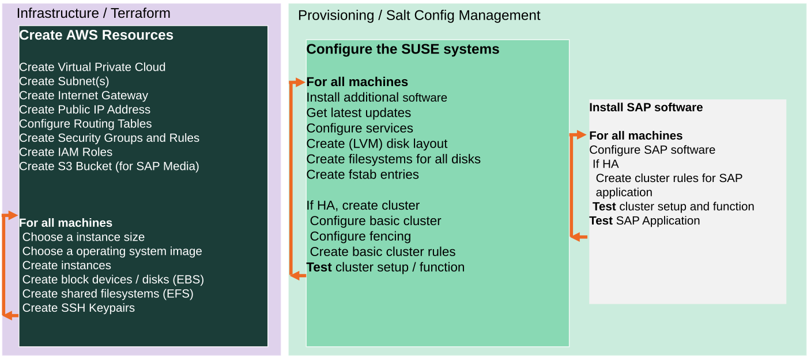

# AWS Public Cloud deployment with Terraform and Salt

* [Quickstart](#quickstart)
   * [Bastion](#bastion)
* [Highlevel description](#highlevel-description)
* [Customization](#customization)
   * [QA deployment](#qa-deployment)
   * [Pillar files configuration](#pillar-files-configuration)
   * [Delete secrets and sensitive information after deployment](#delete-secrets-and-sensitive-information-after-deployment)
   * [Use already existing network resources](#use-already-existing-network-resources)
   * [Autogenerated network addresses](#autogenerated-network-addresses)
   * [HANA configuration](#hana-configuration)
* [Advanced Customization](#advanced-customization)
   * [Terraform Parallelism](#terraform-parallelism)
   * [Remote State](#remote-state)
   * [How to upload a custom image](#how-to-upload-a-custom-image)
* [Troubleshooting](#troubleshooting)

This sub directory contains the cloud specific part for usage of this
repository with Amazon Web Services (AWS). Looking for another
provider? See [Getting started](../README.md#getting-started)

# Quickstart

This is a very short quickstart guide. For detailed information see [Using SUSE Automation to Deploy an SAP HANA Cluster on AWS - Getting Started🔗](https://documentation.suse.com/sbp/all/single-html/TRD-SLES-SAP-HA-automation-quickstart-cloud-aws/).


For detailed information and deployment options have a look at `terraform.tfvars.example`.

1) **Rename terraform.tfvars:**

    ```
    mv terraform.tfvars.example terraform.tfvars
    ```

    Now, the created file must be configured to define the deployment.

    **Note:** Find some help in for IP addresses configuration below in [Customization](#customization).

2) **Generate private and public keys for the cluster nodes without specifying the passphrase:**

    Alternatively, you can set the `pre_deployment` variable to automatically create the cluster ssh keys.

    ```
    mkdir -p ../salt/sshkeys
    ssh-keygen -f ../salt/sshkeys/cluster.id_rsa -q -P ""
    ```

    The key files need to have same name as defined in [terraform.tfvars](terraform.tfvars.example).

3) **[Adapt saltstack pillars manually](../pillar_examples/)** or set the `pre_deployment` variable to automatically copy the example pillar files.

4) **Configure API access to AWS**

    A pair of AWS API access key and secret key will be required;

    there are several ways to configure the keys:

    - env. variables

    ```
    $ export AWS_ACCESS_KEY_ID="<HERE_GOES_THE_ACCESS_KEY>"
    $ export AWS_SECRET_ACCESS_KEY="<HERE_GOES_THE_SECRET_KEY>"
    $ export AWS_DEFAULT_REGION="eu-central-1"
    $ terraform plan
    ```

    - AWS credentials

    There are 2 ways of using the AWS credentials. Using the access key id and the secret access key or using an already existing credentials file, being both options self exclusive (the first option has preference).

    To use the first option basically set the values `aws_access_key_id` and `aws_secret_access_key` in the `terraform.tfvars`.

    To use the credentials file, configure the values for the access key and the secret key in a credentials file located in `$HOME/.aws/credentials`. The syntax of the file is:

    ```
    [default]
    aws_access_key_id = <HERE_GOES_THE_ACCESS_KEY>
    aws_secret_access_key = <HERE_GOES_THE_SECRET_KEY>
    ```

    This file is also used by the `aws` command line tool, so it can be created with the command: `aws configure`.

    **Note**: All tests so far with this configuration have been done with only the keys stored in the credentials files, and the region being passed as a variable.

    - AWS user authorizations

    In order to execute the deployment properly using terraform, the used user must have some policies enabled. Mostly, it needs access to manage EC2 instances, S3 buckets, IAM (to create roles and policies) and EFS storage.

    In order to setup the IAM proper rights, 2 options are available:

    - Set the `IAMFullAccess` policy to the user running the project (or to the group which the user belongs to). This is not recommended as this IAM policy give full IAM access to the user.
    - A better and more secure option, is to create a new policy to give access to create roles with rights to only manage EC2 instances. This will make the project executable, but won't set any other IAM permission to the users. This option is the recommended one. To use this approach, create the next policy giving a meaningful name (`TerraformIAMPolicies` for example) and attach it to the users that will run the project (or the group the users belong to):

        ```
        {
            "Version": "2012-10-17",
            "Statement": [
                {
                    "Effect": "Allow",
                    "Action": [
                        "iam:CreateServiceLinkedRole",
                        "iam:PassRole",
                        "iam:CreateRole",
                        "iam:TagRole",
                        "iam:GetRole",
                        "iam:DeleteRole",
                        "iam:GetRolePolicy",
                        "iam:PutRolePolicy",
                        "iam:DeleteRolePolicy",
                        "iam:ListInstanceProfilesForRole",
                        "iam:CreateInstanceProfile",
                        "iam:GetInstanceProfile",
                        "iam:RemoveRoleFromInstanceProfile",
                        "iam:DeleteInstanceProfile",
                        "iam:AddRoleToInstanceProfile"
                    ],
                    "Resource": "*"
                }
            ]
        }
        ```
        		
    The policy must be attached only to the `IAM` service if it's created manually and not with the json inline option.

    Here how it should look like your user or group:


    

    **Warning: If you use the 2nd option, the AWS web panel won't show that the created instances have any role attached, but they have. The limits in the IAM access makes this not visible, that's all**

5) **Deploy**:

    ```
    terraform init
    terraform workspace new myexecution # optional
    terraform workspace select myexecution # optional
    terraform plan
    terraform apply
    ```

    To get rid of the deployment, destroy the created infrastructure with:

    ```
    terraform destroy
    ```


## Bastion

A bastion host is not implemented for AWS. 

# Highlevel description

The terraform configuration creates the infrastructure needed for the installation of an SAP HANA cluster in System Replication mode, combined with the high-availability capabilities provided by the SUSE Linux Enterprise Server for SAP Applications in *AWS*.



The infrastructure deployed includes:

- Virtual Private Cloud (VPC) network
- subnets within the VPC network
- A security group with rules for access to the instances created in the subnet. Only allowed external network traffic is for the protocols: SSH, HTTP, HTTPS, and for the HAWK service. Internally to the subnet, all traffic is allowed.
- public IP Addresses
- route tables
- IAM Roles
- EC2 instances
- EBS disks
- shared EFS filesystems
- SSH key pairs

By default it creates 3 instances in AWS: one for support services (mainly iSCSI as most other services - DHCP, NTP, etc - are provided by Amazon) and 2 cluster nodes, but this can be changed to deploy more cluster nodes as needed.

# Customization

In order to deploy the environment, different configurations are available through the terraform variables. These variables can be configured using a `terraform.tfvars` file. An example is available in [terraform.tfvars.example](./terraform.tvars.example). To find all the available variables check the [variables.tf](./variables.tf) file.

## QA deployment

The project has been created in order to provide the option to run the deployment in a `Test` or `QA` mode. This mode only enables the packages coming properly from SLE channels, so no other packages will be used. Set `offline_mode = true` in `terraform.tfvars` to enable it.

## Pillar files configuration

Besides the `terraform.tfvars` file usage to configure the deployment, a more advanced configuration is available through pillar files customization. Find more information [here](../pillar_examples/README.md).

## Delete secrets and sensitive information after deployment

To delete e.g. `/etc/salt/grains` and other sensitive information from the hosts after a successful deployment, you can set `cleanup_secrets = true` in `terraform.tfvars`. This is disabled by default.

## Use already existing network resources

The usage of already existing network resources (vpc and security groups) can be done configuring the `terraform.tfvars` file and adjusting some variables. The example of how to use them is available at [terraform.tfvars.example](terraform.tfvars.example).

**Important: In order to use the deployment with an already existing vpc, it must have an internet gateway attached.**

### Relevant Details

There are some fixed values used throughout the terraform configuration:

- The private IP address of the iSCSI server is set to 10.0.0.254.
- The cluster nodes are created with private IPs starting with 10.0.1.0 and on. The instance running with 10.0.1.0 is used initially as the master node of the cluster, ie, the node where `ha-cluster-init` is run.
- The iSCSI server has a second disk volume that is being used as a shared device.
- Salt is partitioning this device in 5 x 1MB partitions and then configuring just the LUN 0 for iSCSI (improvement is needed in iscsi-formula to create more than one device). **Until this improvement is added, an iscsi config file (/etc/target/saveconfig.json) is loaded when the qa_mode is set to true to configure 5 more LUN, mandatory for other tests like DRBD.**
- iSCSI LUN 0 is being used in the cluster as SBD device.
- The cluster nodes have a second disk volume that is being used for HANA installation.

## Autogenerated network addresses

The assignment of the addresses of the nodes in the network can be automatically done in order to avoid
this configuration. For that, basically, remove or comment all the variables related to the ip addresses (more information in [variables.tf](variables.tf)). With this approach all the addresses are retrieved based in the provided virtual network addresses range (`vnet_address_range`).

**Note:** If you are specifying the IP addresses manually, make sure these are valid IP addresses. They should not be currently in use by existing instances. In case of shared account usage, it is recommended to set unique addresses with each deployment to avoid using same addresses.

AWS has a pretty specific way of managing the addresses. Due to its architecture, each of the machines in a cluster must be in a different subnet to have HA capabilities. Besides that, the Virtual addresses must be outside of VPC address range too.

Example based on `10.0.0.0/16` address range (VPC address range) and `192.168.1.0/24` as `virtual_address_range` (the default value):

| Service                          | Variable                     | Addresses                                                      | Comments                                                                                            |
| ----                             | --------                     | ---------                                                      | --------                                                                                            |
| iSCSI server                     | `iscsi_srv_ip`               | `10.0.0.4`                                                     |                                                                                                     |
| Monitoring                       | `monitoring_srv_ip`          | `10.0.0.5`                                                     |                                                                                                     |
| HANA ips                         | `hana_ips`                   | `10.0.1.10`, `10.0.2.11`                                       |                                                                                                     |
| HANA cluster vip                 | `hana_cluster_vip`           | `192.168.1.10`                                                 | Only used if HA is enabled in HANA                                                                  |
| HANA cluster vip secondary       | `hana_cluster_vip_secondary` | `192.168.1.11`                                                 | Only used if the Active/Active setup is used                                                        |
| DRBD ips                         | `drbd_ips`                   | `10.0.5.20`, `10.0.6.21`                                       |                                                                                                     |
| DRBD cluster vip                 | `drbd_cluster_vip`           | `192.168.1.20`                                                 |                                                                                                     |
| S/4HANA or NetWeaver ips         | `netweaver_ips`              | `10.0.3.30`, `10.0.4.31`, `10.0.3.32`, `10.0.4.33`             | Addresses for the ASCS, ERS, PAS and AAS. The sequence will continue if there are more AAS machines |
| S/4HANA or NetWeaver virtual ips | `netweaver_virtual_ips`      | `192.168.1.30`, `192.168.1.31`, `192.168.1.32`, `192.168.1.33` | The last number of the address will match with the regular address                                  |

## HANA configuration

### HANA data disks configuration

The whole disk configuration is made by configuring a variable named `hana_data_disks_configuration`. It encapsulates hard disk selection, logical volumes and data destinations in a compact form. This section describes all parameters line by line.

```
variable "hana_data_disks_configuration" {
  disks_type       = "gp2,gp2,gp2,gp2,gp2,gp2,gp2"
  disks_size       = "128,128,128,128,128,128,128"
  # The next variables are used during the provisioning
  luns             = "0,1#2,3#4#5#6"
  names            = "data#log#shared#usrsap#backup"
  lv_sizes         = "100#100#100#100#100"
  paths            = "/hana/data#/hana/log#/hana/shared#/usr/sap#/hana/backup"
}
```

During deployment, HANA VM expects a standard set of directories for its data storage `/hana/data`, `/hana/log`, `/hana/shared`, `/usr/sap` and `/hana/backup`. 

A HANA VM typically uses 5 to 10 disks according to usage scenario. These are combined to several logical volumes. At last the data locations of the standard mount points are assigned to these logical volumes.

The first two parameters `disks_type` and `disks_size` are used to provision the resources in terraform. One disk is using one entry. Every further disk is added by appending more comma separated entries to each parameter.

In Detail: `disks_type` selects the sort of SSD with bandwidth and redundancy options. You find possible selections and costs at [Amazon EBS volume types](https://docs.aws.amazon.com/AWSEC2/latest/UserGuide/ebs-volume-types.html).
The parameter `disks_size` selects the size of each disk in GB.

The disks are counted from left to right beginning with **0**. This number is called LUN. A Logical Unit Number (LUN) is a SCSI concept for logical abstraction targeting physical drives. If you have 5 disks you count **0,1,2,3,4**.

After describing the physical disks, the logical volumes can be specified using the parameters `luns`, `names`, `lv_sizes` and `paths`. The comma combines several values into one value and the `#` sign is used for separation of volume groups. Think about the `#` sign as a column separator in a table then it will look like:

 | Parameter     | VG1        | VG2       | VG3          | VG4      | VG5          |
 | ---------     | ---        | ---       | ---          | ---      | ---          |
 | **luns**      | 0,1        | 2,3       | 4            | 5        | 6            |
 | **names**     | data       | log       | shared       | usrsap   | backup       |
 | **lv_sizes**  | 100        | 100       | 1000         | 100      | 100          |
 | **paths**     | /hana/data | /hana/log | /hana/shared | /usr/sap | /hana/backup |

As you see, there are 5 volume groups specified. Each volume group has its own name. It is set with parameter `names`.  The parameter `luns` assigns one LUN or a combination of several LUNs to a volume group. In the example above `data` uses disk with LUN **0** and **1**, but `backup` only uses disk with LUN **6**. A LUN can only be assigned to one volume group.

Using the example above for volume group `data` again to show how a HANA VM is affected. As said the `data` volume group uses two physical disks. They are used as physical volumes (i. e. `/dev/sdc` and `/dev/sdd` resp. LUN **0** and **1**). Both physical volumes share the same volume group named `vg_hana_data`. A logical volume named `lv_hana_data_0` allocates **100%** of this volume group. The logical volume name is generated from the volume group name. The logical volume is mounted at mount point `/hana/data`.

It is also possible to deploy several logical volumes to one volume group. For example:

 | Parameter     | VG1                  |
 | ---------     | ---                  |
 | **luns**      | 0,1                  |
 | **names**     | datalog              |
 | **lv_sizes**  | 75,25                |
 | **paths**     | /hana/data,/hana/log |

If both disks have a size of 512GB, a first virtual volume with name `vg_hana_datalog_0` and size of 768GB and a second virtual volume with name `vg_hana_datalog_1` and size 256GB are created. Both virtual volumes are in volume group `vg_hana_datalog`. The first is mounted at `/hana/data` and the second at `/hana/log`.

# Advanced Customization

## Terraform Parallelism

When deploying many scale-out nodes, e.g. 8 or 10, you should must pass the [`-nparallelism=n`🔗](https://www.terraform.io/docs/cli/commands/apply.html#parallelism-n) parameter to `terraform apply` operations.

It "limit[s] the number of concurrent operation as Terraform walks the graph."

The default value of `10` is not sufficient because not all HANA cluster nodes will get provisioned at the same. A value of e.g. `30` should not hurt for most use-cases.

## Remote State

**Important**: If you want to use remote terraform states, first follow the [procedure to create a remote terraform state](create_remote_state).

## How to upload a custom image

This configuration uses the public **SUSE Linux Enterprise Server 15 for SAP Applications BYOS x86_64** image available in AWS (as defined in the file [variables.tf](variables.tf)) and can be used as is.

If the use of a private/custom image is required (for example, to perform the Build Validation of a new AWS Public Cloud image), first upload the image to the cloud using the [procedure described below](#upload-image-to-aws), and then [register it as an AMI](#import-ami-via-snapshot). Once the new AMI is available, edit its AMI id value in the [terraform.tfvars](terraform.tfvars.example) file for your region of choice.

To define the custom AMI in terraform, you should use the [terraform.tfvars](terraform.tfvars.example) file:

```
hana_os_image = "ami-xxxxxxxxxxxxxxxxx"
```

You could also use an image available in the AWS store, in human readable form:

```
hana_os_image = "suse-sles-sap-15-sp1-byos"
```

An image owner can also be specified:
```
hana_os_owner = "amazon"
```

## Upload image to AWS

Instead of the public OS images referenced in this configuration, the EC2 instances can also be launched using a private OS images as long as it is uploaded to AWS as a Amazon Machine Image (AMI). These images have to be in raw format.

In order to upload the raw images as an AMI, first an Amazon S3 bucket is required to store the raw image. This can be created with the following command using the aws-cli (remember to configure aws-cli access with `aws configure`):

```
aws s3 mb s3://instmasters --region eu-central-1
```

This creates an S3 bucket called `instmasters`, which will be used during the rest of this document. Verify the existing S3 buckets in the account with `aws s3 ls`.

After the bucket has been created, the next step is to copy the raw image file to the bucket; be sure to decompress it before uploading it to the S3 bucket:

```
unxz SLES12-SP4-SAP-EC2-HVM-BYOS.x86_64-0.9.2-Build1.1.raw.xz
aws s3 cp SLES12-SP4-SAP-EC2-HVM-BYOS.x86_64-0.9.2-Build1.1.raw s3://instmasters/
```

The above example is using the SLES 12-SP4 for SAP for EC2 BYOS raw image file. Substitute that with the file name of the image you wish to test.

#### Create AMI

##### IAM Role creation and setup

Once the raw image file is in an Amazon S3 bucket, the next step is to create an IAM role and policy to allow the import of images.

First, create a `trust-policy.json` file with the following content:

```
{
   "Version": "2012-10-17",
   "Statement": [
      {
         "Effect": "Allow",
         "Principal": { "Service": "vmie.amazonaws.com" },
         "Action": "sts:AssumeRole",
         "Condition": {
            "StringEquals":{
               "sts:Externalid": "vmimport"
            }
         }
      }
   ]
}
```

Then, create a `role-policy.json` file with the following content:

```
{
   "Version":"2012-10-17",
   "Statement":[
      {
         "Effect":"Allow",
         "Action":[
            "s3:GetBucketLocation",
            "s3:GetObject",
            "s3:ListBucket"
         ],
         "Resource":[
            "arn:aws:s3:::instmasters",
            "arn:aws:s3:::instmasters/*"
         ]
      },
      {
         "Effect":"Allow",
         "Action":[
            "ec2:ModifySnapshotAttribute",
            "ec2:CopySnapshot",
            "ec2:RegisterImage",
            "ec2:Describe*"
         ],
         "Resource":"*"
      }
   ]
}
```

Note that the `role-policy.json` file references the `instmasters` S3 Bucket, so change that value accordingly.

Once the files have been created, run the following commands to create the `vmimport` role and to put the role policy into it:

```
aws iam create-role --role-name vmimport --assume-role-policy-document file://trust-policy.json
aws iam put-role-policy --role-name vmimport --policy-name vmimport --policy-document file://role-policy.json
```

Check the output of the commands for any errors.

#### Import AMI

To import the raw image into an AMI, the command `aws ec2 import-image` needs to be called. This command requires a disk containers file which specifies the location of the raw image file in the S3 Bucket, as well as the description of the AMI to import.

First create a `container.json` file with the following content:

```
[
  {
     "Description": "SLES4SAP 12-SP4 Beta4 Build 1.1",
     "Format": "raw",
     "UserBucket": {
         "S3Bucket": "instmasters",
         "S3Key": "SLES12-SP4-SAP-EC2-HVM-BYOS.x86_64-0.9.2-Build1.1.raw"
     }
  }
]
```

Substitute the values for `Description`, `S3Bucket` and `S3Key` with the values corresponding to the image you wish to upload and the S3 Bucket where the raw file is located.

Once the file is created, import the image with the command:

```
aws ec2 import-image --description "SLES4SAP 12-SP4 Beta4 Build 1.1" --license BYOL --disk-containers file://container.json
```

Again, substitute the description with the description text of the image you will be testing.

The output of the `aws ec2 import-image` should look like this:

```
{
    "Status": "active",
    "LicenseType": "BYOL",
    "Description": "SLES4SAP 12-SP4 Beta4 Build 1.1",
    "Progress": "2",
    "SnapshotDetails": [
        {
            "UserBucket": {
                "S3Bucket": "instmasters",
                "S3Key": "SLES12-SP4-SAP-EC2-HVM-BYOS.x86_64-0.9.2-Build1.1.raw"
            },
            "DiskImageSize": 0.0,
            "Format": "RAW"
        }
    ],
    "StatusMessage": "pending",
    "ImportTaskId": "import-ami-0e6e37788ae2a340b"
}
```

This will say that the import process is active and that it is pending, so you will need the `aws ec2 describe-import-image-tasks` command to check the progress. For example:

```
$ aws ec2 describe-import-image-tasks --import-task-ids import-ami-0e6e37788ae2a340b
{
    "ImportImageTasks": [
        {
            "Status": "active",
            "Description": "SLES4SAP 12-SP4 Beta4 Build 1.1",
            "Progress": "28",
            "SnapshotDetails": [
                {
                    "Status": "active",
                    "UserBucket": {
                        "S3Bucket": "instmasters",
                        "S3Key": "SLES12-SP4-SAP-EC2-HVM-BYOS.x86_64-0.9.2-Build1.1.raw"
                    },
                    "DiskImageSize": 10737418240.0,
                    "Description": "SLES4SAP 12-SP4 Beta4 Build 1.1",
                    "Format": "RAW"
                }
            ],
            "StatusMessage": "converting",
            "ImportTaskId": "import-ami-0e6e37788ae2a340b"
        }
    ]
}
```

Wait until the status is **completed** and search for the image id to use in the test. This image id (a string starting with `ami-`) should be added to the file [variables.tf](variables.tf) in order to be used in the terraform configuration included here.

#### Import AMI via snapshot

An alternate way to convert a raw image into an AMI is to first upload a snapshot of the raw image, and then convert the snapshot into an AMI. This is helpful sometimes as it bypasses some checks performed by `aws ec2 import-image` such as kernel version checks.

First, create a `container-snapshot.json` file with the following content:

```
{
     "Description": "SLES4SAP 12-SP4 Beta4 Build 1.1",
     "Format": "raw",
     "UserBucket": {
         "S3Bucket": "instmasters",
         "S3Key": "SLES12-SP4-SAP-EC2-HVM-BYOS.x86_64-0.9.2-Build1.1.raw"
     }
}
```

Notice that the syntax of the `container.json` file and the `container-snapshot.json` file are mostly the same, with the exception of the opening and closing brackets on the `container.json` file.

Substitute the Description, S3Bucket and S3Key for the correct values of the image to validate. In the case of the `instmasters` bucket, the S3Key can be found with `aws s3 ls s3://instmasters`.

Once the file has been created, import the snapshot with the following command:

```
aws ec2 import-snapshot --description "SLES4SAP 12-SP4 Beta4 Build 1.1" --disk-container file://container-snapshot.json
```

The output of this command should look like this:

```
{
    "SnapshotTaskDetail": {
        "Status": "active",
        "Description": "SLES4SAP 12-SP4 Beta4 Build 1.1",
        "Format": "RAW",
        "DiskImageSize": 0.0,
        "Progress": "3",
        "UserBucket": {
            "S3Bucket": "instmasters",
            "S3Key": "SLES12-SP4-SAP-EC2-HVM-BYOS.x86_64-0.9.2-Build1.1.raw"
        },
        "StatusMessage": "pending"
    },
    "Description": "SLES4SAP 12-SP4 Beta4 Build 1.1",
    "ImportTaskId": "import-snap-0fbbe899f2fd4bbdc"
}
```

Similar to the `import-image` command, the process stays running in the background in AWS. You can check its progress with the command:

```
aws ec2 describe-import-snapshot-tasks --import-task-ids import-snap-0fbbe899f2fd4bbdc
```

Be sure to use the proper `ImportTaskId` value from the output of your `aws ec2 import-snapshot` command.

When the process is completed, the `describe-import-snapshot-tasks` command will output something like this:

```
{
    "ImportSnapshotTasks": [
        {
            "SnapshotTaskDetail": {
                "Status": "completed",
                "Description": "SLES4SAP 12-SP4 Beta4 Build 1.1",
                "Format": "RAW",
                "DiskImageSize": 10737418240.0,
                "SnapshotId": "snap-0a369f803b17037bb",
                "UserBucket": {
                    "S3Bucket": "instmasters",
                    "S3Key": "SLES12-SP4-SAP-EC2-HVM-BYOS.x86_64-0.9.2-Build1.1.raw"
                }
            },
            "Description": "SLES4SAP 12-SP4 Beta4 Build 1.1",
            "ImportTaskId": "import-snap-0fbbe899f2fd4bbdc"
        }
    ]
}
```

Notice the **completed** status in the above JSON output.

Also notice tne `SnapshotId` which will be used in the next step to register the AMI.

Once the snapshot is completely imported, the next step is to register an AMI with the command:

```
aws ec2 register-image --architecture x86_64 --description "SLES 12-SP4 Beta4 Build 1.1" --name sles-12-sp4-b4-b1.1 --root-device-name "/dev/sda1" --virtualization-type hvm --block-device-mappings "DeviceName=/dev/sda1,Ebs={DeleteOnTermination=true,SnapshotId=snap-0a369f803b17037bb,VolumeSize=40,VolumeType=gp2}"
```

Substitute in the above command line the description, name and snapshot id with the appropriate values for your image.

The output, should include the image id. This image id (a string starting with `ami-`) should be added to the file [variables.tf](variables.tf) in order to be used in the terraform configuration included here.

More information regarding the import of images into AWS can be found in [this Amazon document🔗](https://docs.aws.amazon.com/vm-import/latest/userguide/vmimport-image-import.html) or in [this blog post🔗](https://www.wavether.com/2016/11/import-qcow2-images-into-aws).

Examples of the JSON files used in this document have been added to this repo.

# Troubleshooting

In case you have some issue, take a look at this [troubleshooting guide](../doc/troubleshooting.md).
