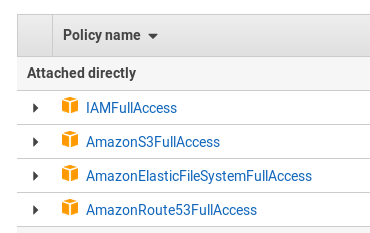

# AWS Public Cloud deployment with terraform and Salt

- [quickstart](#quickstart)
- [highlevel description](#highlevel-description)
- [advanced usage](#advanced-usage)
- [monitoring](../doc/monitoring.md)
- [specification](#specification)

# Quickstart

1) **Rename terraform.tfvars:** `mv terraform.tfvars.example terraform.tfvars`

Now, the created file must be configured to define the deployment.

**Note:** Find some help in the IP addresses configuration in [IP auto generation](../doc/ip_autogeneration.md#AWS)

2) **Generate private and public keys for the cluster nodes without specifying the passphrase:**

Alternatively, you can set the `pre_deployment` variable to automatically create the cluster ssh keys.
```
mkdir -p ../salt/sshkeys
ssh-keygen -f ../salt/sshkeys/cluster.id_rsa -q -P ""
```

The key files need to have same name as defined in [terraform.tfvars](terraform.tfvars.example)

3) **[Adapt saltstack pillars manually](../pillar_examples/)** or set the `pre_deployment` variable to automatically copy the example pillar files.

4) **Configure API access to AWS**

A pair of AWS API access key and secret key will be required;

there are several ways to configure the keys:


- env. variables

```
$ export AWS_ACCESS_KEY_ID="<HERE_GOES_THE_ACCESS_KEY>"
$ export AWS_SECRET_ACCESS_KEY="<HERE_GOES_THE_SECRET_KEY>"
$ export AWS_DEFAULT_REGION="eu-central-1"
$ terraform plan
```

- AWS credentials

There are 2 ways of using the AWS credentials. Using the access key id and the secret access key or using an already existing credentials file, being both options self exclusive (the first option has preference).

To use the first option basically set the values `aws_access_key_id` and `aws_secret_access_key` in the `terraform.tfvars`.

To use the credentials file, configure the values for the access key and the secret key in a credentials file located in `$HOME/.aws/credentials`. The syntax of the file is:

```
[default]
aws_access_key_id = <HERE_GOES_THE_ACCESS_KEY>
aws_secret_access_key = <HERE_GOES_THE_SECRET_KEY>
```

This file is also used by the `aws` command line tool, so it can be created with the command: `aws configure`.

**Note**: All tests so far with this configuration have been done with only the keys stored in the credentials files, and the region being passed as a variable.

- AWS user authorizations

In order to execute the deployment properly using terraform, the used user must have some policies enabled. Mostly, it needs access to manage EC2 instances, S3 buckets, IAM (to create roles and policies) and EFS storage.

In order to setup the IAM proper rights, 2 options are available:
- Set the `IAMFullAccess` policy to the user running the project (or to the group which the user belongs to). This is not recommended as this IAM policy give full IAM access to the user.
- A better and more secure option, is to create a new policy to give access to create roles with rights to only manage EC2 instances. This will make the project executable, but won't set any other IAM permission to the users. This option is the recommended one. To use this approach, create the next policy giving a meaningful name (`TerraformIAMPolicies` for example) and attach it to the users that will run the project (or the group the users belong to):

```
{
    "Version": "2012-10-17",
    "Statement": [
        {
            "Effect": "Allow",
            "Action": [
                "iam:CreateServiceLinkedRole",
                "iam:PassRole",
                "iam:CreateRole",
                "iam:TagRole",
                "iam:GetRole",
                "iam:DeleteRole",
                "iam:GetRolePolicy",
                "iam:PutRolePolicy",
                "iam:DeleteRolePolicy",
                "iam:ListInstanceProfilesForRole",
                "iam:CreateInstanceProfile",
                "iam:GetInstanceProfile",
                "iam:RemoveRoleFromInstanceProfile",
                "iam:DeleteInstanceProfile",
                "iam:AddRoleToInstanceProfile"
            ],
            "Resource": "*"
        }
    ]
}
```
The policy must be attached only to the `IAM` service if it's created manually and not with the json inline option.

Here how it should look like your user or group:




**Warning: If you use the 2nd option, the AWS web panel won't show that the created instances have any role attached, but they have. The limits in the IAM access makes this not visible, that's all**


5) **Deploy**:

```
terraform init
terraform workspace new myexecution # optional
terraform workspace select myexecution # optional
terraform plan
terraform apply
```

Destroy the created infrastructure with:

```
terraform destroy
```


# Highlevel description

The terraform configuration creates the infrastructure needed for the installation of an SAP HANA cluster in System Replication mode, combined with the high-availability capabilities provided by the SUSE Linux Enterprise Server for SAP Applications in *AWS*.

The infrastructure deployed includes:

- A Virtual Private Cloud
- A local subnet within the VPC
- A security group with rules for access to the instances created in the subnet. Only allowed external network traffic is for the protocols: SSH, HTTP, HTTPS, and for the HAWK service. Internally to the subnet, all traffic is allowed.
- An Internet gateway
- A route table with its corresponding associations.
- EC2 instances.

By default it creates 3 instances in AWS: one for support services (mainly iSCSI as most other services - DHCP, NTP, etc - are provided by Amazon) and 2 cluster nodes, but this can be changed to deploy more cluster nodes as needed.

# Specifications

In order to deploy the environment, different configurations are available through the terraform variables. These variables can be configured using a `terraform.tfvars` file. An example is available in [terraform.tfvars.example](./terraform.tvars.example). To find all the available variables check the [variables.tf](./variables.tf) file.

## QA deployment

The project has been created in order to provide the option to run the deployment in a `Test` or `QA` mode. This mode only enables the packages coming properly from SLE channels, so no other packages will be used. The mode is selected by setting the variable offline_mode to true.

## Pillar files configuration

Besides the `terraform.tfvars` file usage to configure the deployment, a more advanced configuration is available through pillar files customization. Find more information [here](../pillar_examples/README.md).

## Use already existing network resources

The usage of already existing network resources (vpc and security groups) can be done configuring the `terraform.tfvars` file and adjusting some variables. The example of how to use them is available at [terraform.tfvars.example](terraform.tfvars.example).

**Important: In order to use the deployment with an already existing vpc, it must have an internet gateway attached.**

### Relevant Details

There are some fixed values used throughout the terraform configuration:

- The private IP address of the iSCSI server is set to 10.0.0.254.
- The cluster nodes are created with private IPs starting with 10.0.1.0 and on. The instance running with 10.0.1.0 is used initially as the master node of the cluster, ie, the node where `ha-cluster-init` is run.
- The iSCSI server has a second disk volume that is being used as a shared device.
- Salt is partitioning this device in 5 x 1MB partitions and then configuring just the LUN 0 for iSCSI (improvement is needed in iscsi-formula to create more than one device). **Until this improvement is added, an iscsi config file (/etc/target/saveconfig.json) is loaded when the qa_mode is set to true to configure 5 more LUN, mandatory for other tests like DRBD.**
- iSCSI LUN 0 is being used in the cluster as SBD device.
- The cluster nodes have a second disk volume that is being used for HANA installation.

# Advanced Usage
# notes:

**Important**: If you want to use remote terraform states, first follow the [procedure to create a remote terraform state](create_remote_state).

This configuration uses the public **SUSE Linux Enterprise Server 15 for SAP Applications BYOS x86_64** image available in AWS (as defined in the file [variables.tf](variables.tf)) and can be used as is.

If the use of a private/custom image is required (for example, to perform the Build Validation of a new AWS Public Cloud image), first upload the image to the cloud using the [procedure described below](#upload-image-to-aws), and then [register it as an AMI](#import-ami-via-snapshot). Once the new AMI is available, edit its AMI id value in the [terraform.tfvars](terraform.tfvars.example) file for your region of choice.

**Important:** The image used for the iSCSI server **must be at least SLES 15 version** since the iSCSI salt formula is not compatible with lower versions.

To define the custom AMI in terraform, you should use the [terraform.tfvars](terraform.tfvars.example) file:

```
hana_os_image = "ami-xxxxxxxxxxxxxxxxx"
```

You could also use an image available in the AWS store, in human readable form:

```
hana_os_image = "suse-sles-sap-15-sp1-byos"
```

An image owner can also be specified:
```
hana_os_owner = "amazon"
```

OS for each module can be configured independently.


After an `apply` command, terraform will deploy the insfrastructure to the cloud and output the public IP addresses and names of the iSCSI server and the cluster nodes. Connect using `ssh` as the user `ec2-user`, for example:

```
ssh ec2-user@18.196.143.128
```


By default this configuration will deploy the infrastructure to the `eu-central-1` region of AWS. Internally, the provided terraform files are only configured for the European (eu-central-1, eu-west-1, eu-west-2 and eu-west-3) and North American zones (us-east-1, us-east-2, us-west-1, us-west-2 and ca-central-1), but this as well as the default zone can be changed by editing the [variables.tf](variables.tf) or the [terraform.tfvars](terraform.tfvars.example) files.

It is also possible to change the AWS region from the command line with the `-var aws_region` parameter, for example:

```
terraform apply -var aws_region=eu-central-1
```

Will deploy the insfrastructure in Frankfurt.

The EC2 instances for the cluster nodes are created by default with the type `m4.2xlarge`, this can be changed with the option `-var instancetype`. For example:

```
terraform apply -var aws_region=eu-central-1 -var instancetype=m4.large
```

Will deploy 2 `m4.large` instances in Frankfurt, instead of the `m4.2xlarge` default ones. The iSCSI server is always deployed with the `t2.micro` type instance.

Finally, the number of cluster nodes can be modified with the option `-var hana_count`. For example:

```
terraform apply -var aws_region=eu-central-1 -var hana_count=4
```

Will deploy in Frankfurt 1 `t2.micro` instance as an iSCSI server, and 4 `m4.2xlarge` instances as cluster nodes.

All this means that basically the default command `terraform apply` and be also written as `terraform apply -var instancetype=m4.2xlarge -var hana_count=2`.


## Upload image to AWS

Instead of the public OS images referenced in this configuration, the EC2 instances can also be launched using a private OS images as long as it is uploaded to AWS as a Amazon Machine Image (AMI). These images have to be in raw format.

In order to upload the raw images as an AMI, first an Amazon S3 bucket is required to store the raw image. This can be created with the following command using the aws-cli (remember to configure aws-cli access with `aws configure`):

```
aws s3 mb s3://instmasters --region eu-central-1
```

This creates an S3 bucket called `instmasters`, which will be used during the rest of this document. Verify the existing S3 buckets in the account with `aws s3 ls`.

After the bucket has been created, the next step is to copy the raw image file to the bucket; be sure to decompress it before uploading it to the S3 bucket:

```
unxz SLES12-SP4-SAP-EC2-HVM-BYOS.x86_64-0.9.2-Build1.1.raw.xz
aws s3 cp SLES12-SP4-SAP-EC2-HVM-BYOS.x86_64-0.9.2-Build1.1.raw s3://instmasters/
```

The above example is using the SLES 12-SP4 for SAP for EC2 BYOS raw image file. Substitute that with the file name of the image you wish to test.

## Create AMI

### IAM Role creation and setup

Once the raw image file is in an Amazon S3 bucket, the next step is to create an IAM role and policy to allow the import of images.

First, create a `trust-policy.json` file with the following content:

```
{
   "Version": "2012-10-17",
   "Statement": [
      {
         "Effect": "Allow",
         "Principal": { "Service": "vmie.amazonaws.com" },
         "Action": "sts:AssumeRole",
         "Condition": {
            "StringEquals":{
               "sts:Externalid": "vmimport"
            }
         }
      }
   ]
}
```

Then, create a `role-policy.json` file with the following content:

```
{
   "Version":"2012-10-17",
   "Statement":[
      {
         "Effect":"Allow",
         "Action":[
            "s3:GetBucketLocation",
            "s3:GetObject",
            "s3:ListBucket"
         ],
         "Resource":[
            "arn:aws:s3:::instmasters",
            "arn:aws:s3:::instmasters/*"
         ]
      },
      {
         "Effect":"Allow",
         "Action":[
            "ec2:ModifySnapshotAttribute",
            "ec2:CopySnapshot",
            "ec2:RegisterImage",
            "ec2:Describe*"
         ],
         "Resource":"*"
      }
   ]
}
```

Note that the `role-policy.json` file references the `instmasters` S3 Bucket, so change that value accordingly.

Once the files have been created, run the following commands to create the `vmimport` role and to put the role policy into it:

```
aws iam create-role --role-name vmimport --assume-role-policy-document file://trust-policy.json
aws iam put-role-policy --role-name vmimport --policy-name vmimport --policy-document file://role-policy.json
```

Check the output of the commands for any errors.

### Import AMI

To import the raw image into an AMI, the command `aws ec2 import-image` needs to be called. This command requires a disk containers file which specifies the location of the raw image file in the S3 Bucket, as well as the description of the AMI to import.

First create a `container.json` file with the following content:

```
[
  {
     "Description": "SLES4SAP 12-SP4 Beta4 Build 1.1",
     "Format": "raw",
     "UserBucket": {
         "S3Bucket": "instmasters",
         "S3Key": "SLES12-SP4-SAP-EC2-HVM-BYOS.x86_64-0.9.2-Build1.1.raw"
     }
  }
]
```

Substitute the values for `Description`, `S3Bucket` and `S3Key` with the values corresponding to the image you wish to upload and the S3 Bucket where the raw file is located.

Once the file is created, import the image with the command:

```
aws ec2 import-image --description "SLES4SAP 12-SP4 Beta4 Build 1.1" --license BYOL --disk-containers file://container.json
```

Again, substitute the description with the description text of the image you will be testing.

The output of the `aws ec2 import-image` should look like this:

```
{
    "Status": "active",
    "LicenseType": "BYOL",
    "Description": "SLES4SAP 12-SP4 Beta4 Build 1.1",
    "Progress": "2",
    "SnapshotDetails": [
        {
            "UserBucket": {
                "S3Bucket": "instmasters",
                "S3Key": "SLES12-SP4-SAP-EC2-HVM-BYOS.x86_64-0.9.2-Build1.1.raw"
            },
            "DiskImageSize": 0.0,
            "Format": "RAW"
        }
    ],
    "StatusMessage": "pending",
    "ImportTaskId": "import-ami-0e6e37788ae2a340b"
}
```

This will say that the import process is active and that it is pending, so you will need the `aws ec2 describe-import-image-tasks` command to check the progress. For example:

```
$ aws ec2 describe-import-image-tasks --import-task-ids import-ami-0e6e37788ae2a340b
{
    "ImportImageTasks": [
        {
            "Status": "active",
            "Description": "SLES4SAP 12-SP4 Beta4 Build 1.1",
            "Progress": "28",
            "SnapshotDetails": [
                {
                    "Status": "active",
                    "UserBucket": {
                        "S3Bucket": "instmasters",
                        "S3Key": "SLES12-SP4-SAP-EC2-HVM-BYOS.x86_64-0.9.2-Build1.1.raw"
                    },
                    "DiskImageSize": 10737418240.0,
                    "Description": "SLES4SAP 12-SP4 Beta4 Build 1.1",
                    "Format": "RAW"
                }
            ],
            "StatusMessage": "converting",
            "ImportTaskId": "import-ami-0e6e37788ae2a340b"
        }
    ]
}
```

Wait until the status is **completed** and search for the image id to use in the test. This image id (a string starting with `ami-`) should be added to the file [variables.tf](variables.tf) in order to be used in the terraform configuration included here.

### Import AMI via snapshot

An alternate way to convert a raw image into an AMI is to first upload a snapshot of the raw image, and then convert the snapshot into an AMI. This is helpful sometimes as it bypasses some checks performed by `aws ec2 import-image` such as kernel version checks.

First, create a `container-snapshot.json` file with the following content:

```
{
     "Description": "SLES4SAP 12-SP4 Beta4 Build 1.1",
     "Format": "raw",
     "UserBucket": {
         "S3Bucket": "instmasters",
         "S3Key": "SLES12-SP4-SAP-EC2-HVM-BYOS.x86_64-0.9.2-Build1.1.raw"
     }
}
```

Notice that the syntax of the `container.json` file and the `container-snapshot.json` file are mostly the same, with the exception of the opening and closing brackets on the `container.json` file.

Substitute the Description, S3Bucket and S3Key for the correct values of the image to validate. In the case of the `instmasters` bucket, the S3Key can be found with `aws s3 ls s3://instmasters`.

Once the file has been created, import the snapshot with the following command:

```
aws ec2 import-snapshot --description "SLES4SAP 12-SP4 Beta4 Build 1.1" --disk-container file://container-snapshot.json
```

The output of this command should look like this:

```
{
    "SnapshotTaskDetail": {
        "Status": "active",
        "Description": "SLES4SAP 12-SP4 Beta4 Build 1.1",
        "Format": "RAW",
        "DiskImageSize": 0.0,
        "Progress": "3",
        "UserBucket": {
            "S3Bucket": "instmasters",
            "S3Key": "SLES12-SP4-SAP-EC2-HVM-BYOS.x86_64-0.9.2-Build1.1.raw"
        },
        "StatusMessage": "pending"
    },
    "Description": "SLES4SAP 12-SP4 Beta4 Build 1.1",
    "ImportTaskId": "import-snap-0fbbe899f2fd4bbdc"
}
```

Similar to the `import-image` command, the process stays running in the background in AWS. You can check its progress with the command:

```
aws ec2 describe-import-snapshot-tasks --import-task-ids import-snap-0fbbe899f2fd4bbdc
```

Be sure to use the proper `ImportTaskId` value from the output of your `aws ec2 import-snapshot` command.

When the process is completed, the `describe-import-snapshot-tasks` command will output something like this:

```
{
    "ImportSnapshotTasks": [
        {
            "SnapshotTaskDetail": {
                "Status": "completed",
                "Description": "SLES4SAP 12-SP4 Beta4 Build 1.1",
                "Format": "RAW",
                "DiskImageSize": 10737418240.0,
                "SnapshotId": "snap-0a369f803b17037bb",
                "UserBucket": {
                    "S3Bucket": "instmasters",
                    "S3Key": "SLES12-SP4-SAP-EC2-HVM-BYOS.x86_64-0.9.2-Build1.1.raw"
                }
            },
            "Description": "SLES4SAP 12-SP4 Beta4 Build 1.1",
            "ImportTaskId": "import-snap-0fbbe899f2fd4bbdc"
        }
    ]
}
```

Notice the **completed** status in the above JSON output.

Also notice tne `SnapshotId` which will be used in the next step to register the AMI.

Once the snapshot is completely imported, the next step is to register an AMI with the command:

```
aws ec2 register-image --architecture x86_64 --description "SLES 12-SP4 Beta4 Build 1.1" --name sles-12-sp4-b4-b1.1 --root-device-name "/dev/sda1" --virtualization-type hvm --block-device-mappings "DeviceName=/dev/sda1,Ebs={DeleteOnTermination=true,SnapshotId=snap-0a369f803b17037bb,VolumeSize=40,VolumeType=gp2}"
```

Substitute in the above command line the description, name and snapshot id with the appropriate values for your image.

The output, should include the image id. This image id (a string starting with `ami-`) should be added to the file [variables.tf](variables.tf) in order to be used in the terraform configuration included here.

More information regarding the import of images into AWS can be found in [this Amazon document](https://docs.aws.amazon.com/vm-import/latest/userguide/vmimport-image-import.html) or in [this blog post](https://www.wavether.com/2016/11/import-qcow2-images-into-aws).

Examples of the JSON files used in this document have been added to this repo.

## Logs

This configuration is leaving logs in `/var/log` folder in each of the instances. Connect as `ssh ec2-user@<remote_ip>`, then do a `sudo su -` and check the following files:

* **/var/log/salt-result.log**: This is the global log file, inside it you will find the logs for user_data, salt-predeployment and salt-deployment
* **/var/log/salt-predeployment.log**: Check here the debug log for the salt pre-deployment execution if you need to troubleshoot something.
* **/var/log/salt-deployment.log**: Same as above but for the final SAP/HA/DRBD deployments salt execution logs.
