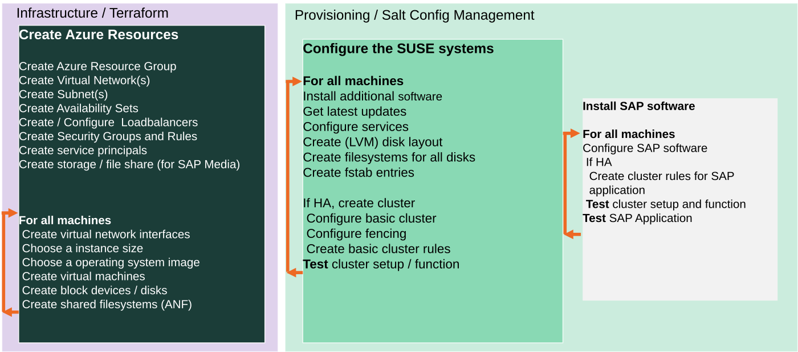

# Azure Public Cloud deployment with Terraform and Salt

* [Quickstart](#quickstart)
   * [Bastion](#bastion)
* [Highlevel description](#highlevel-description)
* [Customization](#customization)
   * [QA deployment](#qa-deployment)
   * [Pillar files configuration](#pillar-files-configuration)
   * [Delete secrets and sensitive information after deployment](#delete-secrets-and-sensitive-information-after-deployment)
   * [Use already existing network resources](#use-already-existing-network-resources)
   * [Autogenerated network addresses](#autogenerated-network-addresses)
   * [HANA configuration](#hana-configuration)
   * [S/4HANA and NetWeaver configuration](#s4hana-and-netweaver-configuration)
* [Advanced Customization](#advanced-customization)
   * [Terraform Parallelism](#terraform-parallelism)
   * [Configure non-interactive Terraform Access to Azure](#configure-non-interactive-terraform-access-to-azure)
   * [How to upload a custom image](#how-to-upload-a-custom-image)
   * [Use native fencing instead of SBD](#use-native-fencing-instead-of-sbd)
   * [Use Azure ANF (Azure Netapp Files)](#use-azure-anf-azure-netapp-files)


This sub directory contains the cloud specific part for usage of this
repository with Microsoft Azure. Looking for another provider? See
[Getting started](../README.md#getting-started).


# Quickstart

This is a very short quickstart guide. For detailed information see [Using SUSE Automation to Deploy an SAP HANA Cluster on Azure - Getting Started🔗](https://documentation.suse.com/sbp/all/single-html/TRD-SLES-SAP-HA-automation-quickstart-cloud-azure/).

For detailed information and deployment options also have a look at `terraform.tfvars.example`.

1) **Rename terraform.tfvars:**

    ```
    mv terraform.tfvars.example terraform.tfvars
    ```

    Now, the created file must be configured to define the deployment.

    **Note:** Find some help in for IP addresses configuration below in [Customization](#customization).

2) **Generate private and public keys for the cluster nodes without specifying the passphrase:**

    Alternatively, you can set the `pre_deployment` variable to automatically create the cluster ssh keys.

    ```
    mkdir -p ../salt/sshkeys
    ssh-keygen -f ../salt/sshkeys/cluster.id_rsa -q -P ""
    ```

    The key files need to have same name as defined in [terraform.tfvars](./terraform.tfvars.example).

3) **[Adapt saltstack pillars manually](../pillar_examples/)** or set the `pre_deployment` variable to automatically copy the example pillar files.

4) **Configure Terraform Access to Azure**

    Install the azure command line client

    * [Azure CLI🔗](https://docs.microsoft.com/en-us/cli/azure/install-azure-cli-zypper?view=azure-cli-latest)

    Setup Azure account:

    * Login with  `az login`.

    * Check that the account has subscriptions with `az account list`. It should show you an entry for the tenant, and at least an entry for a subscription.

    Then set the default subscription with the command `az account set`, for example, if using the **"SUSE R&D General"** subscription, the default subscription is defined with:

    ```
    az account set --subscription "SUSE R&D General"
    ```

    You should be able to deploy now.

    To verify which subscription is the active one, use the command `az account show`.

5) **Deploy**

    The deployment can now be started with:

    ```
    terraform init
    terraform workspace new myexecution # optional
    terraform workspace select myexecution # optional
    terraform plan
    terraform apply
    ```

    To get rid of the deployment, destroy the created infrastructure with:

    ```
    terraform destroy
    ```


## Bastion

By default, the bastion machine is enabled in Azure (it can be disabled), which will have the unique public IP address of the deployed resource group. Connect using ssh and the selected admin user with:

```
ssh {admin_user}@{bastion_ip} -i {private_key_location}
```

To log to hana and others instances, use:

```
ssh -o ProxyCommand="ssh -W %h:%p {admin_user}@{bastion_ip} -i {private_key_location} -o UserKnownHostsFile=/dev/null -o StrictHostKeyChecking=no" {admin_user}@{private_hana_instance_ip} -i {private_key_location} -o UserKnownHostsFile=/dev/null -o StrictHostKeyChecking=no
```

To disable the bastion use:

```
bastion_enabled = false
```

Destroy the created infrastructure with:

```
terraform destroy
```

# Highlevel description

The terraform configuration files in this directory can be used to create the infrastructure required to install a SAP HanaSR cluster on Suse Linux Enterprise Server for SAP Applications in **Azure**.



The infrastructure deployed includes:

* azure resource group
* virtual network
* subnets within the virtual network
* Public IP access for the virtual machines (if enabled)
* Network security group with rules for access to the instances created in the subnet. Only allowed external network traffic is for the protocols: SSH, HTTP, HTTPS, and for the HAWK service. Internally to the subnet, all traffic is allowed.
* availability sets
* load balancers
* service principals
* virtual machines
* network interface cards
* block devices
* shared ANF filesystems (if enabled)

By default, this configuration creates 3 virtual machines in Azure: one for support services (mainly iSCSI as most other services are provided by Azure), and 2 cluster nodes, but this can be changed to deploy more cluster nodes as needed.

Once the infrastructure is created by Terraform, the servers are provisioned with Salt.

# Customization

In order to deploy the environment, different configurations are available through the terraform variables. These variables can be configured using a `terraform.tfvars` file. An example is available in [terraform.tfvars.example](./terraform.tvars.example). To find all the available variables check the [variables.tf](./variables.tf) file.

## QA deployment

The project has been created in order to provide the option to run the deployment in a `Test` or `QA` mode. This mode only enables the packages coming properly from SLE channels, so no other packages will be used. Set `offline_mode = true` in `terraform.tfvars` to enable it.

## Pillar files configuration

Besides the `terraform.tfvars` file usage to configure the deployment, a more advanced configuration is available through pillar files customization. Find more information [here](../pillar_examples/README.md).

## Delete secrets and sensitive information after deployment

To delete e.g. `/etc/salt/grains` and other sensitive information from the hosts after a successful deployment, you can set `cleanup_secrets = true` in `terraform.tfvars`. This is disabled by default.

## Use already existing network resources

The usage of already existing network resources (virtual network and subnets) can be done configuring
the `terraform.tfvars` file and adjusting some variables. The example of how to use them is available
at [terraform.tfvars.example](terraform.tfvars.example).

## Autogenerated network addresses

The assignment of the addresses of the nodes in the network can be automatically done in order to avoid
this configuration. For that, basically, remove or comment all the variables related to the ip addresses (more information in [variables.tf](variables.tf)). With this approach all the addresses are retrieved based in the provided virtual network addresses range (`vnet_address_range`).

**Note:** If you are specifying the IP addresses manually, make sure these are valid IP addresses. They should not be currently in use by existing instances. In case of shared account usage, it is recommended to set unique addresses with each deployment to avoid using same addresses.

Example based on `10.74.0.0/16` vnet address range and `10.74.0.0/24` subnet address range:

| Service                          | Variable                     | Addresses                                                  | Comments                                                                                               |
| ----                             | --------                     | ---------                                                  | --------                                                                                               |
| iSCSI server                     | `iscsi_srv_ip`               | `10.74.0.4`                                                |                                                                                                        |
| Monitoring                       | `monitoring_srv_ip`          | `10.74.0.5`                                                |                                                                                                        |
| HANA ips                         | `hana_ips`                   | `10.74.0.10`, `10.74.0.11`                                 |                                                                                                        |
| HANA cluster vip                 | `hana_cluster_vip`           | `10.74.0.12`                                               | Only used if HA is enabled in HANA                                                                     |
| HANA cluster vip secondary       | `hana_cluster_vip_secondary` | `10.74.0.13`                                               | Only used if the Active/Active setup is used                                                           |
| DRBD ips                         | `drbd_ips`                   | `10.74.0.20`, `10.74.0.21`                                 |                                                                                                        |
| DRBD cluster vip                 | `drbd_cluster_vip`           | `10.74.0.22`                                               |                                                                                                        |
| S/4HANA or NetWeaver ips         | `netweaver_ips`              | `10.74.0.30`, `10.74.0.31`, `10.74.0.32`, `10.74.0.33`     | Addresses for the ASCS, ERS, PAS and AAS. The sequence will continue if there are more AAS machines    |
| S/4HANA or NetWeaver virtual ips | `netweaver_virtual_ips`      | `10.74.0.34`, `10.74.0.35`, `10.74.0.36`, `192.168.135.37` | The 1st virtual address will be the next in the sequence of the regular S/4HANA or NetWeaver addresses |

## HANA configuration

### HANA data disks configuration

The whole disk configuration is made by configuring a variable named `hana_data_disks_configuration`. It encapsulates hard disk selection, logical volumes and data destinations in a compact form. This section describes all parameters line by line.

```
variable "hana_data_disks_configuration" {
  disks_type       = "Premium_LRS,Premium_LRS,Premium_LRS,Premium_LRS,Premium_LRS,Premium_LRS,Premium_LRS"
  disks_size       = "128,128,128,128,128,128,128"
  caching          = "None,None,None,None,None,None,None"
  writeaccelerator = "false,false,false,false,false,false,false"
   luns     = "0,1#2,3#4#5#6"
  names    = "data#log#shared#usrsap#backup"
  lv_sizes = "100#100#100#100#100"
  paths    = "/hana/data#/hana/log#/hana/shared#/usr/sap#/hana/backup"
}
```

During deployment, HANA VM expects a standard set of directories for its data storage `/hana/data`, `/hana/log`, `/hana/shared`, `/usr/sap` and `/hana/backup`. 

A HANA VM typically uses 5 to 10 disks according to usage scenario. These are combined to several logical volumes. At last the data locations of the standard mount points are assigned to these logical volumes.

The first four parameters `disks_type`, `disks_size`, `caching` and `writeaccelerator` are used to provision the resources in terraform. One disk is using one entry. Every further disk is added by appending more comma separated entries to each parameter.

In Detail: `disks_type` selects the sort of SSD with bandwidth and redundancy options. You find possible selections and costs at [Azure – Managed Disks🔗](https://azure.microsoft.com/en-us/pricing/details/managed-disks/).
The parameter `disks_size` selects the size of each disk in GB. Also you can decide if `caching` or the `writeaccelerator` is active.

The disks are counted from left to right beginning with **0**. This number is called LUN. A Logical Unit Number (LUN) is a SCSI concept for logical abstraction targeting physical drives. If you have 5 disks you count **0,1,2,3,4**.

After describing the physical disks, the logical volumes can be specified using the parameters `luns`, `names`, `lv_sizes` and `paths`. The comma combines several values into one value and the `#` sign is used for separation of volume groups. Think about the `#` sign as a column separator in a table then it will look like:

 | Parameter     | VG1        | VG2       | VG3          | VG4      | VG5          |
 | ---------     | ---        | ---       | ---          | ---      | ---          |
 | **luns**      | 0,1        | 2,3       | 4            | 5        | 6            |
 | **names**     | data       | log       | shared       | usrsap   | backup       |
 | **lv_sizes**  | 100        | 100       | 1000         | 100      | 100          |
 | **paths**     | /hana/data | /hana/log | /hana/shared | /usr/sap | /hana/backup |

As you see, there are 5 volume groups specified. Each volume group has its own name. It is set with parameter `names`.  The parameter `luns` assigns one LUN or a combination of several LUNs to a volume group. In the example above `data` uses disk with LUN **0** and **1**, but `backup` only uses disk with LUN **6**. A LUN can only be assigned to one volume group.

Using the example above for volume group `data` again to show how a HANA VM is affected. As said the `data` volume group uses two physical disks. They are used as physical volumes (i. e. `/dev/sdc` and `/dev/sdd` resp. LUN **0** and **1**). Both physical volumes share the same volume group named `vg_hana_data`. A logical volume named `lv_hana_data_0` allocates **100%** of this volume group. The logical volume name is generated from the volume group name. The logical volume is mounted at mount point `/hana/data`.

It is also possible to deploy several logical volumes to one volume group. For example:

 | Parameter     | VG1                  |
 | ---------     | ---                  |
 | **luns**      | 0,1                  |
 | **names**     | datalog              |
 | **lv_sizes**  | 75,25                |
 | **paths**     | /hana/data,/hana/log |

If both disks have a size of 512GB, a first virtual volume with name `vg_hana_datalog_0` and size of 768GB and a second virtual volume with name `vg_hana_datalog_1` and size 256GB are created. Both virtual volumes are in volume group `vg_hana_datalog`. The first is mounted at `/hana/data` and the second at `/hana/log`.


### HANA data disks configuration example setups

The database configuration may vary depending on the expected performance. In order to have different options, the virtual machine size, disks, network configuration, etc must be configured differently. Here some predefined options that might help in the configuration.

For example, the disks configuration for the HANA database is a crucial step in order to deploy a functional database. The configuration creates multiple logical volumes to get the best performance of the database. Here listed some of the configurations that can be deployed to have difference experiences. Update your `terraform.tfvars` with these values. By default the **demo** option is deployed.
**Use other values only if you know what you are doing**.

The **Demo** and **Small** sizes are targeted for non-production systems. The **Medium** and **Large** sizes can be used for production systems.

 |            | /hana/data          | /hana/log          | /hana/shared | /usr/sap    | /hana/backup     |
 | --------   | ----------          | ---------          | ------------ | --------    | ------------     |
 | **Demo**   | 2x128GB LUN 0,1     | 2x128GB LUN 2,3    | 128GB  LUN 4 | 128GB LUN 5 | 128GB    LUN 6   |
 | **Small**  | 3x512GB LUN 0,1,2   | ← shared with data | 512GB  LUN 3 | 64GB  LUN 4 | 1024GB   LUN 5   |
 | **Medium** | 4x512GB LUN 0,1,2,3 | 2x512GB ¹ LUN 4,5  | 1024GB LUN 6 | 64GB  LUN 7 | 2x1024GB LUN 8,9 |
 | **Large**  | 3x1024GB LUN 0,1,2  | 2x512GB ¹ LUN 3,4  | 1024GB LUN 5 | 64GB  LUN 6 | 2x2048GB LUN 7,8 |

 ¹ use Azure feature "writeAccelerator" if deployed on several VMs

#### Demo

```
hana_count = "2"
hana_vm_size = "Standard_E4s_v3"
hana_enable_accelerated_networking = false
hana_data_disks_configuration = {
  disks_type       = "Premium_LRS,Premium_LRS,Premium_LRS,Premium_LRS,Premium_LRS,Premium_LRS,Premium_LRS"
  disks_size       = "128,128,128,128,128,128,128"
  caching          = "None,None,None,None,None,None,None"
  writeaccelerator = "false,false,false,false,false,false,false"
  luns             = "0,1#2,3#4#5#6#7"
  names            = "data#log#shared#usrsap#backup"
  lv_sizes         = "100#100#100#100#100"
  paths            = "/hana/data#/hana/log#/hana/shared#/usr/sap#/hana/backup"
}
```

#### Small

```
hana_count = "2"
hana_vm_size = "Standard_E64s_v3"
hana_enable_accelerated_networking = true
hana_data_disks_configuration = {
  disks_type       = "Premium_LRS,Premium_LRS,Premium_LRS,Premium_LRS,Premium_LRS,Premium_LRS"
  disks_size       = "512,512,512,512,64,1024"
  caching          = "ReadOnly,ReadOnly,ReadOnly,ReadOnly,ReadOnly,None"
  writeaccelerator = "false,false,false,false,false,false"
  luns             = "0,1,2#3#4#5"
  names            = "datalog#shared#usrsap#backup"
  lv_sizes         = "70,100#100#100#100"
  paths            = "/hana/data,/hana/log#/hana/shared#/usr/sap#/hana/backup"
}
```

#### Medium

```
hana_count = "2"
hana_vm_size = "Standard_M64s"
hana_enable_accelerated_networking = true
hana_data_disks_configuration = {
  disks_type       = "Premium_LRS,Premium_LRS,Premium_LRS,Premium_LRS,Premium_LRS,Premium_LRS,Premium_LRS,Premium_LRS,Premium_LRS,Premium_LRS"
  disks_size       = "512,512,512,512,512,512,1024,64,1024,1024"
  caching          = "ReadOnly,ReadOnly,ReadOnly,ReadOnly,None,None,ReadOnly,ReadOnly,ReadOnly,ReadOnly"
  writeaccelerator = "false,false,false,false,false,false,false,false,false,false"
  luns             = "0,1,2,3#4,5#6#7#8,9"
  names            = "data#log#shared#usrsap#backup"
  lv_sizes         = "100#100#100#100#100"
  paths            = "/hana/data#/hana/log#/hana/shared#/usr/sap#/hana/backup"
}
```

#### Large

```
hana_count = "2"
hana_vm_size = "Standard_M128s"
hana_enable_accelerated_networking = true
hana_data_disks_configuration = {
  disks_type       = "Premium_LRS,Premium_LRS,Premium_LRS,Premium_LRS,Premium_LRS,Premium_LRS,Premium_LRS,Premium_LRS,Premium_LRS"
  disks_size       = "1024,1024,1024,512,512,1024,64,2048,2048"
  caching          = "ReadOnly,ReadOnly,ReadOnly,None,None,ReadOnly,ReadOnly,ReadOnly,ReadOnly"
  writeaccelerator = "false,false,false,true,true,false,false,false,false"
  luns             = "0,1,2#3,4#5#6#7,8"
  names            = "data#log#shared#usrsap#backup"
  lv_sizes         = "100#100#100#100#100"
  paths            = "/hana/data#/hana/log#/hana/shared#/usr/sap#/hana/backup"
}
```

#### Scale-Out

Please look at [HANA Scale-Out scenario](#HANA-Scale-Out-scenario).

## S/4HANA and NetWeaver configuration

There are different NetWeaver configurations available depending on if the environment is an HA one or not, and the expected performance. Here some guidelines for the different options:

To set a 3-tier deployment (simple NetWeaver, without HA) use the next options:

```
netweaver_enabled = true
netweaver_ha_enabled = false
netweaver_cluster_sbd_enabled = false
drbd_enabled = false
netweaver_nfs_share = your_nfs_share:/mount_point
```

For 3-tier HA deployment:

```
netweaver_enabled = true
netweaver_ha_enabled = true
netweaver_cluster_sbd_enabled = true
drbd_enabled = true
```

Besides that, the expected performance setting the vm sizes, networking and disk different options need to be defined. Here are some suggested options (by default the **demo** option is deployed):


### Example NetWeaver configurations

#### Demo

```
netweaver_xscs_vm_size = "Standard_D2s_v3"
netweaver_app_vm_size = "Standard_D2s_v3"
netweaver_data_disk_type = "Premium_LRS"
netweaver_data_disk_size = 128
netweaver_data_disk_caching = ""ReadWrite""
netweaver_xscs_accelerated_networking = false
netweaver_app_accelerated_networking = false
netweaver_app_server_count = 2
```

#### Small

```
netweaver_xscs_vm_size = "Standard_D2s_v3"
netweaver_app_vm_size = "Standard_E64s_v3"
netweaver_data_disk_type = "Premium_LRS"
netweaver_data_disk_size = 128
netweaver_data_disk_caching = ""ReadWrite""
netweaver_xscs_accelerated_networking = false
netweaver_app_accelerated_networking = true
netweaver_app_server_count = 5
```

#### Medium

```
netweaver_xscs_vm_size = "Standard_D2s_v3"
netweaver_app_vm_size = "Standard_E64s_v3"
netweaver_data_disk_type = "Premium_LRS"
netweaver_data_disk_size = 128
netweaver_data_disk_caching = "ReadWrite"
netweaver_xscs_accelerated_networking = false
netweaver_app_accelerated_networking = true
netweaver_app_server_count = 5
```

#### Large

```
netweaver_xscs_vm_size = "Standard_D2s_v3"
netweaver_app_vm_size = "Standard_E64s_v3"
netweaver_data_disk_type = "Premium_LRS"
netweaver_data_disk_size = 128
netweaver_data_disk_caching = "ReadWrite"
netweaver_xscs_accelerated_networking = false
netweaver_app_accelerated_networking = true
netweaver_app_server_count = 10
```

#### deploy on ANF shared storage (recommended when using HANA scale-out)

```
netweaver_shared_storage_type = "anf"
anf_pool_size                 = 15        # align with HANA scale-out
anf_pool_service_level        = "Ultra"   # align with HANA scale-out
netweaver_anf_quota_sapmnt    = "2000"    # see azure documentation about quota sizes and throughput
```

### HANA Scale-Out scenario

Please read [Deploy a SAP HANA scale-out system with standby node on Azure VMs by using Azure NetApp Files on SUSE Linux Enterprise Server🔗](https://docs.microsoft.com/en-us/azure/virtual-machines/workloads/sap/sap-hana-scale-out-standby-netapp-files-suse) to get an idea how this setup will look like.

To enable a scale-out deployment on 4,6,8,... HANA nodes you have to raise the `hana_count` variable accordingly.

These parameters need to be provided in `terraform.tfvars`. There are also advanced parameters with examples in this file.

```
hana_count = 6
hana_scale_out_enabled = true
hana_scale_out_standby_count = 1 # default:1 - Deploy X standby nodes per site. The rest of the nodes will be worker nodes.
```

You will also need shared storage for /hana/{data,log,backup,shared} for this.

At the moment ANF is supported on Azure in this sceanario. You can defined via these variables in `terraform.tfvars`:
Please read the Azure documentation about [Sizing for HANA database on Azure NetApp Files🔗](https://docs.microsoft.com/en-us/azure/virtual-machines/workloads/sap/sap-hana-scale-out-standby-netapp-files-suse#sizing-for-hana-database-on-azure-netapp-files) to review what are the minimal requirements for your setup.

```
hana_scale_out_shared_storage_type = ""      # only anf supported at the moment (default: "")
anf_pool_size                      = "15"    # min 30TB on Premium, min 15TB on Ultra
anf_pool_service_level             = "Ultra" # Standard (does not meet KPI), Premium, Ultra
hana_scale_out_anf_quota_data      = "4000"  # deployed 2x (for each site)
hana_scale_out_anf_quota_log       = "4000"  # deployed 2x (for each site)
hana_scale_out_anf_quota_backup    = "2000"  # deployed 2x (for each site)
hana_scale_out_anf_quota_shared    = "4000"  # deployed 2x (for each site)

# to also deploy NetWeaver on ANF (recommended)
netweaver_shared_storage_type      = "anf"
netweaver_anf_quota_sapmnt         = "2000"  # deployed 1x
```

A single local disk is also needed and can be configured like this (or use the defaults):

```
hana_data_disks_configuration = {
  disks_type       = "Premium_LRS"
  disks_size       = "10"
  caching          = "None"
  writeaccelerator = "false"
  # The next variables are used during the provisioning
  luns        = "0"
  names       = "usrsap"
  lv_sizes    = "100"
  mount_paths = "/usr/sap"
}
```

# Advanced Customization

## Terraform Parallelism

When deploying many scale-out nodes, e.g. 8 or 10, you should must pass the [`-nparallelism=n`🔗](https://www.terraform.io/docs/cli/commands/apply.html#parallelism-n) parameter to `terraform apply` operations.

It "limit[s] the number of concurrent operation as Terraform walks the graph."

The default value of `10` is not sufficient because not all HANA cluster nodes will get provisioned at the same. A value of e.g. `30` should not hurt for most use-cases.

## Configure non-interactive Terraform Access to Azure

To setup the authentication for non-interactive purposes (e.g. a CI) you will need 4 variables:

* Subscription ID
* Tenant ID
* Client or App ID
* Client or App Secret

The subscription and tenant id can be seen with the command `az account show`:

```
$ az account show
{
  "environmentName": "AzureCloud",
  "id": "<HERE IS THE SUBSCRIPTION ID>",
  "isDefault": true,
  "name": "<HERE IS THE SUBSCRIPTION NAME>",
  "state": "Enabled",
  "tenantId": "<HERE IS THE TENANT ID>",
  "user": {
    "name": "some@email.address.com",
    "type": "user"
  }
}
```

For the client id and secret, an Azure AD Service Principal is required. If you have the necessary permissions, you can create one with:

```
az ad sp create-for-rbac --name my-terraform-ad-sp --role="Contributor" --scopes="/subscriptions/<HERE GOES THE SUBSCRIPTION ID>"
```

This command should output the necessary client id and client secret or password.

More info in the [Terraform Install Configure document🔗](https://docs.microsoft.com/en-us/azure/virtual-machines/linux/terraform-install-configure) in microsoft.com.

Once all four required parameters are known, there are several ways to configure access for terraform:

* In provider definition

Add the values for subscription id, tenant id, client id and client secret in the file [main.tf](main.tf).

* Via Environment Variables

Set the following environment variables before running terraform:
To verify which subscription is the active one, use the command `az account show`.

```
export ARM_SUBSCRIPTION_ID=your_subscription_id
export ARM_CLIENT_ID=your_appId
export ARM_CLIENT_SECRET=your_password
export ARM_TENANT_ID=your_tenant_id
export ARM_ACCESS_KEY=access_key
```

## How to upload a custom image

In the terraform configuration custom images are used which are defined in the main.tf files of terraform modules (under the `storage_image_reference` block) and referenced as `azurerm_image.iscsi_srv.*.id` and `azurerm_image.sles4sap.*.id`.

This custom images need to be already uploaded to Azure before attempting to use it with terraform, as terraform does not have a mechanism to upload images as of yet.

In order to upload images for further use in terraform, use the procedure defined in the [Upload a custom image](#upload-custom-image) section below. Be sure to set up your Azure account first with the azure-cli to be able to follow that procedure.

On the other hand, if there is a need to use publicly available images, the `terraform.tfvars` file must include the required information as in the following example (by default, the example values are used if new information is not provided in the `terraform.tfvars` file):

```
# Public sles4sap image
sles4sap_public = {
  "publisher" = "SUSE"
  "offer"     = "SLES-SAP-BYOS"
  "sku"       = "12-sp4"
  "version"   = "2019.03.06"
}

# Public iscsi server image
iscsi_srv_public = {
  "publisher" = "SUSE"
  "offer"     = "SLES-SAP-BYOS"
  "sku"       = "15"
  "version"   = "2018.08.20"
}
```

To check the values for publisher, offer, sku and version of the available public images, use the command `az vm image list --output table`. For example, to check for the public images from SUSE available in Azure:

```
az vm image list --output table --publisher SUSE --all
```

If using a public image, skip to the [how to use section](#how-to-use).


### Upload custom image

In order to upload a custom image, a valid resource group, with a storage account and a storage container, is required.

To list the resource groups available to your account, run command `az group list`. If there is a need to create a new resource group, run:

```
az group create --location westeurope --name MyResourceGroup
```

This creates a resource group called **MyResourceGroup**. To verify the details of the resource group, run:

```
az group show --name MyResourceGroup
```

Once you have a resource group, the next step is to create an storage account, do that with:

```
az storage account create --resource-group MyResourceGroup --location westeurope --name MyStorageAccount --kind Storage --sku Standard_LRS
```

This creates the **MyStorageAccount** storage account in the **MyResourceGroup** resource group. Verify that it was created with either of these commands:

```
az storage account list | grep MyStorageAccount
az storage account show --name MyStorageAccount
```

Once you have the storage account, you will need the keys stored in it. You can get that information with the command:

```
az storage account keys list --resource-group MyResourceGroup --account-name MyStorageAccount
```

The output to that command will look like this:

```
[
  {
    "keyName": "key1",
    "permissions": "Full",
    "value": "key_1_value"
  },
  {
    "keyName": "key2",
    "permissions": "Full",
    "value": "key_2_value"
  }
]
```

Either one of these keys is required for the next steps, so keep it on hand. First, to create a storage container:

```
az storage container create --account-name MyStorageAccount --account-key "key_1_value" --name MyStorageContainer
```

This creates a **MyStorageContainer** in the **MyStorageAccount** storage account, using key 1.

Verify that it was created with either of these commands:

```
az storage container list --account-name MyStorageAccount
az storage container show --account-name MyStorageAccount --name MyStorageContainer
```

Once you have set up the storage account and the storage container, the next step is to upload the image. Ensure that the image file to upload is not compressed, and then upload it with the command:

```
az storage blob upload --account-name MyStorageAccount --account-key "key_1_value" --container-name MyStorageContainer --type page --file SLES12-SP4-SAP-Azure-BYOS.x86_64-0.9.0-Build2.1.vhdfixed --name SLES12-SP4-SAP-Azure-BYOS.x86_64-0.9.0-Build2.1.vhd
```

This uploads the image file `SLES12-SP4-SAP-Azure-BYOS.x86_64-0.9.0-Build2.1.vhdfixed` as the blob `SLES12-SP4-SAP-Azure-BYOS.x86_64-0.9.0-Build2.1.vhd`. This process takes a while to complete, depending on the network speed to Azure, and the size of the image.

Verify the image was uploaded with either of the following commands:

```
az storage blob list --account-name MyStorageAccount --container-name MyStorageContainer
az storage blob show --name SLES12-SP4-SAP-Azure-BYOS.x86_64-0.9.0-Build2.1.vhd --container-name MyStorageContainer --account-name MyStorageAccount
az storage blob exists --name SLES12-SP4-SAP-Azure-BYOS.x86_64-0.9.0-Build2.1.vhd --container-name MyStorageContainer --account-name MyStorageAccount
```

Once the image is successfully uploaded, get its URL/URI with the command:

```
az storage blob url --name SLES12-SP4-SAP-Azure-BYOS.x86_64-0.9.0-Build2.1.vhd --container-name MyStorageContainer --account-name MyStorageAccount
```

This URI is used in the terraform configuration, specifically in the main.tf file of corresponding terraform module or via the command line, so keep it on hand.

### Remove resources

To remove resources, substitute show for delete in all check commands. For example:

```
az storage blob delete --name SLES12-SP4-SAP-Azure-BYOS.x86_64-0.9.0-Build2.1.vhd --container-name MyStorageContainer --account-name MyStorageAccount
```

This deletes blob `SLES12-SP4-SAP-Azure-BYOS.x86_64-0.9.0-Build2.1.vhd` from storage container `MyStorageContainer`.

## Use native fencing instead of SBD

SUSE's recommendation is to use SBD (e.g. via iSCSI) to fence cluster nodes.

However using the cloud's native fencing mechanisms is also possible.

In the azure implementation this is the "Azure Fence Agent" called `stonith:fence_azure_arm`.

Please read the Microsoft Azure documentation [Create Azure Fence agent STONITH device🔗](https://docs.microsoft.com/en-us/azure/virtual-machines/workloads/sap/high-availability-guide-suse-pacemaker#create-azure-fence-agent-stonith-device) for the detailed steps that are needed in azure.

Native fencing can be set per cluster type in `terraform.tfvars`:

```
hana_cluster_fencing_mechanism = "native"
drbd_cluster_fencing_mechanism = "native"
netweaver_cluster_fencing_mechanism = "native"
```

## Use Azure ANF (Azure Netapp Files)

To get a basic understanding what ANF is, please look at the Microsoft documentation e.g. [What is Azure NetApp Files🔗](https://docs.microsoft.com/en-us/azure/azure-netapp-files/azure-netapp-files-introduction) and [Quickstart: Set up Azure NetApp Files and create an NFS volume🔗](https://docs.microsoft.com/en-us/azure/azure-netapp-files/azure-netapp-files-quickstart-set-up-account-create-volumes?tabs=azure-portal).

For detailed instructions on how to use it, please look at the storage section of each setup, e.g. HANA/Netweaver.

# Troubleshooting

In case you have some issue, take a look at this [troubleshooting guide](../doc/troubleshooting.md).
