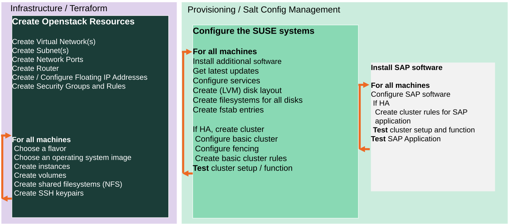

# Libvirt deployment with Terraform and Salt

* [Terraform cluster deployment with Libvirt](#terraform-cluster-deployment-with-libvirt)
* [Requirements](#requirements)
* [Quickstart](#quickstart)
   * [Bastion](#bastion)
* [Highlevel description](#highlevel-description)
* [Customization](#customization)
   * [QA deployment](#qa-deployment)
   * [Pillar files configuration](#pillar-files-configuration)
   * [Delete secrets and sensitive information after deployment](#delete-secrets-and-sensitive-information-after-deployment)
   * [Use already existing network resources](#use-already-existing-network-resources)
   * [Autogenerated network addresses](#autogenerated-network-addresses)
   * [HANA configuration](#hana-configuration)
* [Advanced Customization](#advanced-customization)
   * [Terraform Parallelism](#terraform-parallelism)
* [Troubleshooting](#troubleshooting)


This sub directory contains the cloud specific part for usage of this
repository with libvirt. Looking for another provider? See
[Getting started](../README.md#getting-started).


# Requirements

1) **General KVM Requirements**

   You will need to have a working libvirt/kvm setup for using the libvirt-provider. (refer to upstream doc of [libvirt provider🔗](https://github.com/dmacvicar/terraform-provider-libvirt)).

   You need the xslt processor `xsltproc` installed on the system. With it terraform is able to process xsl files.

2) **Network Requirements**

   The deployment requires two separate networks. One for bootstrapping the machines via DHCP and a second dedicated/isolated network for the deployment itself.
  
   The bootstrap network can use libvirts's 'default' network, which is usually the easiest option. 
   A `sudo virsh net-dumpxml default | grep "bridge name"` will show you the bridge you can set as e.g. `bridge_device = virbr0` in `terraform.tfvars`.
      
   The dedicated/isolated network can either be already existing (set `network_name = "mynet"`) or being created based on the `iprange = ...` parameter.
   Be sure to match a potentially existing network with the `iprange = ...` parameter.
   The IPs addresses in this network will be set to static DHCP entries in libvirt's network config.
   
3) **SBD**

  For libvirt based configurations, the code uses SBD as the STONITH method for clustering.  The SBD disk is created in the storage pool and therefore iSCSI is not required.  When configuring the terraform.tfvars file, ensure that iSCSI is not enabled.

4) **Image Preparation**

  Image files in the qcow2 format are required for this deployment.  Currently, SUSE do not supply qcow2 images for SLES for SAP Application and therefore some preparation is required.  Download the latest openstack qcow2 image from [the SUSE download page](https://www.suse.com/download/sles/).

  A series of commands are necessary to resize and sanitise the image.  Run the following commands in the same directory as the downloaded image ensure you replace <ImageFile> with the name of your image:

  ```bash
  echo 'net.ipv6.conf.all.disable_ipv6 = 1' > 99-disable-ipv6.conf
  qemu-img resize <ImageFile> 20G
  virt-sysprep --operations abrt-data,backup-files,bash-history,blkid-tab,crash-data,cron-spool,customize,dhcp-client-state,dhcp-server-state,dovecot-data,logfiles,machine-id,mail-spool,net-hostname,net-hwaddr,pacct-log,package-manager-cache,pam-data,passwd-backups,puppet-data-log,rh-subscription-manager,rhn-systemid,rpm-db,samba-db-log,script,smolt-uuid,ssh-hostkeys,ssh-userdir,sssd-db-log,tmp-files,udev-persistent-net,utmp,yum-uuid --root-password password:linux --copy-in 99-disable-ipv6.conf:/etc/sysctl.d -a <ImageFile>
  rm 99-disable-ipv6.conf
  ```

  Copy the adapted image to the libvirt pool that you intend to use for the project and that you referenced via `storage_pool = ...`.

  To register the SLES image as a SLES4SAP image you can use this little hack which is rolled out via cloud-init. **You do not have to do this if your image is already a SLES4SAP**.
	
  Adapt the file cloud-config.tpl  so that the installation will register will the required repositories for SLES4SAP.  For this you'll need your SUSE for SAP registration code and the associated email address.  Edit the file so that it matches this, ensuring you replace <SubEmail> and <SubCode> with your details:

  ```yaml
  #cloud-config

  cloud_config_modules:
    - runcmd
  cloud_final_modules:
    - scripts-user
  runcmd:
    - |
      # add any command here
      SUSEConnect -e <SubEmail> -r <SubCode>
      /usr/sbin/SUSEConnect --de-register
      /usr/sbin/SUSEConnect --cleanup
      rpm -e --nodeps sles-release
      rpm -e --nodeps sles-release-DVD
      rpm -e --nodeps sles-release-POOL
      SUSEConnect -p SLES_SAP/15.3/x86_64 -e <SubEmail> -r <SubCode>
      SUSEConnect -p sle-module-basesystem/15.3/x86_64
      SUSEConnect -p sle-module-desktop-applications/15.3/x86_64
      SUSEConnect -p sle-module-server-applications/15.3/x86_64
      SUSEConnect -p sle-ha/15.3/x86_64 -e <SubEmail> -r <SubCode>
      SUSEConnect -p sle-module-sap-applications/15.3/x86_64
      # make sure docs are installed (needed for prometheus-hanadb_exporter)
      sed -i 's#rpm.install.excludedocs.*#rpm.install.excludedocs = no#g' /etc/zypp/zypp.conf 
  ```

# Quickstart

This is a very short quickstart guide.

For detailed information and deployment options have a look at `terraform.tfvars.example`.

1) **Rename terraform.tfvars:**

    ```
    mv terraform.tfvars.example terraform.tfvars
    ```

    Now, the created file must be configured to define the deployment.

    **Note:** Find some help in for IP addresses configuration below in [Customization](#customization).

2) **Generate private and public keys for the cluster nodes without specifying the passphrase:**

    Alternatively, you can set the `pre_deployment` variable to automatically create the cluster ssh keys.

    ```
    mkdir -p ../salt/sshkeys
    ssh-keygen -f ../salt/sshkeys/cluster.id_rsa -q -P ""
    ```

    The key files need to have same name as defined in [terraform.tfvars](./terraform.tfvars.example).

3) **[Adapt saltstack pillars manually](../pillar_examples/)** or set the `pre_deployment` variable to automatically copy the example pillar files.

4) **Configure Terraform Access to Libvirt**

    Set `qemu_uri = "qemu:///system"` in `terraform.tfvars` if you want to deploy on the local system
    or according to [Libvirt Provider🔗](https://registry.terraform.io/providers/dmacvicar/libvirt/latest/docs#the-connection-uri).

    Also make sure the images references in `terraform.tfvars` are existing on your system.

5) **Prepare a NFS share with the installation sources**

	Add the NFS paths to `terraform.tfvars`. The NFS server is not yet part of the deployment and must already exist.

	- **Note:** Find some help in [SAP software documentation](../doc/sap_software.md)

6) **Deploy**

    The deployment can now be started with:

    ```
    terraform init
    terraform workspace new myexecution
    # If you don't create a new workspace , the string `default` will be used as workspace name.
    # This can led to conflicts to unique names in a shared server.
    terraform workspace select myexecution
    terraform plan
    terraform apply
    ```

    To get rid of the deployment, destroy the created infrastructure with:

    ```
    terraform destroy
    ```

## Bastion

A bastion host makes no sense in this setup.

# Highlevel description

This Terraform configuration deploys SAP HANA in a High-Availability Cluster on SUSE Linux Enterprise Server for SAP Applications in **Libvirt**.



The infrastructure deployed includes:

* virtual network
* SBD disks
* libvirt volumes
* virtual machines

By default, this configuration will create 3 instances in Libvirt: one for support services (mainly iSCSI) and 2 cluster nodes, but this can be changed to deploy more cluster nodes as needed.

Once the infrastructure is created by Terraform, the servers are provisioned with Salt.

# Customization

In order to deploy the environment, different configurations are available through the terraform variables. These variables can be configured using a `terraform.tfvars` file. An example is available in [terraform.tfvars.example](./terraform.tvars.example). To find all the available variables check the [variables.tf](./variables.tf) file.

## QA deployment

The project has been created in order to provide the option to run the deployment in a `Test` or `QA` mode. This mode only enables the packages coming properly from SLE channels, so no other packages will be used. Set `offline_mode = true` in `terraform.tfvars` to enable it.

## Pillar files configuration

Besides the `terraform.tfvars` file usage to configure the deployment, a more advanced configuration is available through pillar files customization. Find more information [here](../pillar_examples/README.md).

## Delete secrets and sensitive information after deployment

To delete e.g. `/etc/salt/grains` and other sensitive information from the hosts after a successful deployment, you can set `cleanup_secrets = true` in `terraform.tfvars`. This is disabled by default.

## Use already existing network resources

The usage of already existing network resources (virtual network and images) can be done configuring
the `terraform.tfvars` file and adjusting some variables. The example of how to use them is available
at [terraform.tfvars.example](terraform.tfvars.example).

## Autogenerated network addresses

The assignment of the addresses of the nodes in the network can be automatically done in order to avoid
this configuration. For that, basically, remove or comment all the variables related to the ip addresses (more information in [variables.tf](variables.tf)). With this approach all the addresses are retrieved based in the provided virtual network addresses range (`vnet_address_range`).

**Note:** If you are specifying the IP addresses manually, make sure these are valid IP addresses. They should not be currently in use by existing instances. In case of shared account usage, it is recommended to set unique addresses with each deployment to avoid using same addresses.

Example based on `192.168.135.0/24` address range:

| Service                          | Variable                     | Addresses                                                              | Comments                                                                                               |
| ----                             | --------                     | ---------                                                              | --------                                                                                               |
| iSCSI server                     | `iscsi_srv_ip`               | `192.168.135.4`                                                        |                                                                                                        |
| Monitoring                       | `monitoring_srv_ip`          | `192.168.135.5`                                                        |                                                                                                        |
| HANA IPs                         | `hana_ips`                   | `192.168.135.10`, `192.168.135.11`                                     |                                                                                                        |
| HANA cluster vIP                 | `hana_cluster_vip`           | `192.168.135.12`                                                       | Only used if HA is enabled in HANA                                                                     |
| HANA cluster vIP secondary       | `hana_cluster_vip_secondary` | `192.168.135.13`                                                       | Only used if the Active/Active setup is used                                                           |
| DRBD IPs                         | `drbd_ips`                   | `192.168.135.20`, `192.168.135.21`                                     |                                                                                                        |
| DRBD cluster vIP                 | `drbd_cluster_vip`           | `192.168.135.22`                                                       |                                                                                                        |
| S/4HANA or NetWeaver IPs         | `netweaver_ips`              | `192.168.135.30`, `192.168.135.31`, `192.168.135.32`, `192.168.135.33` | Addresses for the ASCS, ERS, PAS and AAS. The sequence will continue if there are more AAS machines    |
| S/4HANA or NetWeaver virtual IPs | `netweaver_virtual_ips`      | `192.168.135.34`, `192.168.135.35`, `192.168.135.36`, `192.168.135.37` | The first virtual address will be the next in the sequence of the regular S/4HANA or NetWeaver addresses |

## HANA configuration

### HANA data disks configuration

The whole disk configuration is made by configuring a variable named `hana_data_disks_configuration`. It encapsulates hard disk selection, logical volumes and data destinations in a compact form. This section describes all parameters line by line.

```
variable "hana_data_disks_configuration" {
  disks_size       = "128,128,128,128,128,128,128"
  # The next variables are used during the provisioning
  luns             = "0,1#2,3#4#5#6"
  names            = "data#log#shared#usrsap#backup"
  lv_sizes         = "100#100#100#100#100"
  paths            = "/hana/data#/hana/log#/hana/shared#/usr/sap#/hana/backup"
}
```

During deployment, HANA VM expects a standard set of directories for its data storage `/hana/data`, `/hana/log`, `/hana/shared`, `/usr/sap` and `/hana/backup`. 

A HANA VM typically uses 5 to 10 disks according to usage scenario. These are combined to several logical volumes. At last the data locations of the standard mount points are assigned to these logical volumes.

The first parameter `disks_size` is used to provision the resources in terraform. One disk is using one entry. Every further disk is added by appending more comma separated entries to each parameter.

`disks_size` selects the size of each disk in GB.

The disks are counted from left to right beginning with **0**. This number is called LUN. A Logical Unit Number (LUN) is a SCSI concept for logical abstraction targeting physical drives. If you have 5 disks you count **0,1,2,3,4**.

After describing the physical disks, the logical volumes can be specified using the parameters `luns`, `names`, `lv_sizes` and `paths`. The comma combines several values into one value and the `#` sign is used for separation of volume groups. Think about the `#` sign as a column separator in a table then it will look like:

 | Parameter     | VG1        | VG2       | VG3          | VG4      | VG5          |
 | ---------     | ---        | ---       | ---          | ---      | ---          |
 | **luns**      | 0,1        | 2,3       | 4            | 5        | 6            |
 | **names**     | data       | log       | shared       | usrsap   | backup       |
 | **lv_sizes**  | 100        | 100       | 1000         | 100      | 100          |
 | **paths**     | /hana/data | /hana/log | /hana/shared | /usr/sap | /hana/backup |

As you see, there are 5 volume groups specified. Each volume group has its own name. It is set with parameter `names`.  The parameter `luns` assigns one LUN or a combination of several LUNs to a volume group. In the example above `data` uses disk with LUN **0** and **1**, but `backup` only uses disk with LUN **6**. A LUN can only be assigned to one volume group.

Using the example above for volume group `data` again to show how a HANA VM is affected. As said the `data` volume group uses two physical disks. They are used as physical volumes (i. e. `/dev/sdc` and `/dev/sdd` resp. LUN **0** and **1**). Both physical volumes share the same volume group named `vg_hana_data`. A logical volume named `lv_hana_data_0` allocates **100%** of this volume group. The logical volume name is generated from the volume group name. The logical volume is mounted at mount point `/hana/data`.

It is also possible to deploy several logical volumes to one volume group. For example:

 | Parameter     | VG1                  |
 | ---------     | ---                  |
 | **names**     | datalog              |
 | **luns**      | 0,1                  |
 | **lv_sizes**  | 75,25                |
 | **paths**     | /hana/data,/hana/log |

If both disks have a size of 512GB, a first virtual volume with name `vg_hana_datalog_0` and size of 768GB and a second virtual volume with name `vg_hana_datalog_1` and size 256GB are created. Both virtual volumes are in volume group `vg_hana_datalog`. The first is mounted at `/hana/data` and the second at `/hana/log`.

# Advanced Customization

## Terraform Parallelism

When deploying many scale-out nodes, e.g. 8 or 10, you should must pass the [`-nparallelism=n`🔗](https://www.terraform.io/docs/cli/commands/apply.html#parallelism-n) parameter to `terraform apply` operations.

It "limit[s] the number of concurrent operation as Terraform walks the graph."

The default value of `10` is not sufficient because not all HANA cluster nodes will get provisioned at the same. A value of e.g. `30` should not hurt for most use-cases.

# Troubleshooting

In case you have some issue, take a look at this [troubleshooting guide](../doc/troubleshooting.md).

### Terraform fails shortly after deploy

The images use cloud-init which can take a little time to return, so it is not unusual to see an error shortly after 'terraform deploy'.  You may see an error like this:

  ```bash
  Error: Invalid index
     on modules/hana_node/salt_provisioner.tf line 66, in module "hana_provision":
    66:   public_ips   = libvirt_domain.hana_domain.*.network_interface.0.addresses.0
   The given key does not identify an element in this collection value: the collection has no elements.
  ```
  
  If this error occurs, simple re-run `terraform apply` after ~30 seconds.
  
  To get rid of the deployment, destroy the created infrastructure with:
  
  ```bash
  terraform destroy
  ```

### Resources have not been destroyed

Sometimes it happens that created resources are left after running
`terraform destroy`. It happens especially when the `terraform apply` command
was not successful and you tried to destroy the setup in order of resetting the
state of your terraform deployment to zero.
It is often helpful to simply run `terraform destroy` again. However, even when
it succeeds in this case you might still want to check manually for remaining
resources.

For the following commands you need to use the command line tool Virsh. You can
retrieve the QEMU URI Virsh is currently connected to by running the command
`virsh uri`.

### Checking networks

You can run `virsh net-list --all` to list all defined Libvirt networks. You can
delete undesired ones by executing `virsh net-undefine <network_name>`, where
`<network_name>` is the name of the network you like to delete.

### Checking domains

For each node a domain is defined by Libvirt in order to address the specific
machine. You can list all domains by running the command `virsh list`. When you
like to delete a domain you can run `virsh undefine <domain_name>` where
`<domain_name>` is the name of the domain you like to delete.

### Checking images

In case you experience issues with your images such as install ISOs for
operating systems or virtual disks of your machine check the following folder
with elevated privileges: `sudo ls -Faihl /var/lib/libvirt/images/`

### Packages failures

If some package installation fails during the salt provisioning, the
most possible thing is that some repository is missing.
Add the new repository with the needed package and try again.
