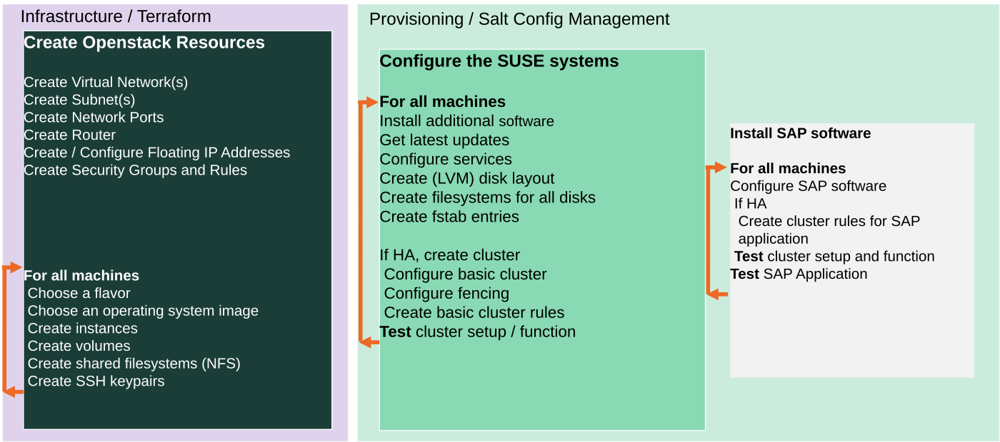

# OpenStack Cloud deployment with Terraform and Salt

* [Quickstart](#quickstart)
   * [Bastion](#bastion)
* [Highlevel description](#highlevel-description)
* [Customization](#customization)
   * [QA deployment](#qa-deployment)
   * [Pillar files configuration](#pillar-files-configuration)
   * [Delete secrets and sensitive information after deployment](#delete-secrets-and-sensitive-information-after-deployment)
   * [Use already existing network resources](#use-already-existing-network-resources)
   * [Autogenerated network addresses](#autogenerated-network-addresses)
   * [HANA configuration](#hana-configuration)
* [Advanced Customization](#advanced-customization)
   * [Terraform Parallelism](#terraform-parallelism)
* [Troubleshooting](#troubleshooting)

This sub directory contains the cloud specific part for usage of this
repository with Openstack. Looking for another provider? See
[Getting started](../README.md#getting-started)

# Quickstart

This is a very short quickstart guide.

For detailed information and deployment options have a look at `terraform.tfvars.example`.

1) **Rename terraform.tfvars:**

    ```
    mv terraform.tfvars.example terraform.tfvars
    ```

    Now, the created file must be configured to define the deployment.

    **Note:** Find some help in for IP addresses configuration below in [Customization](#customization).

2) **Generate private and public keys for the cluster nodes without specifying the passphrase:**

    Alternatively, you can set the `pre_deployment` variable to automatically create the cluster ssh keys.

    ```
    mkdir -p ../salt/sshkeys
    ssh-keygen -f ../salt/sshkeys/cluster.id_rsa -q -P ""
    ```

    The key files need to have same name as defined in [terraform.tfvars](./terraform.tfvars.example).

3) **[Adapt saltstack pillars manually](../pillar_examples/)** or set the `pre_deployment` variable to automatically copy the example pillar files.

4) **Configure Terraform Access to OpenStack**

	- **Optional:** install openstack client (to use for environment variables), e.g.
	   - configure `clouds.yaml` and `clouds-public.yaml`, [openstack client configuration reference🔗](https://docs.openstack.org/python-openstackclient/latest/configuration/index.html#configuration-files)
	   - example installation

	```
	pip install python-openstackclient
	```

	- export OpenStack environment variables (used by `infrastructure.tf`)
	   - more details can be found in the [openstack command line reference🔗](https://docs.openstack.org/python-openstackclient/latest/cli/man/openstack.html#environment-variables)
	   - example configuration

	```
	export OS_CLOUD=my-lab
	export TF_VAR_openstack_auth_url=$(openstack configuration show -c auth.auth_url -f value)
	export TF_VAR_openstack_password=$(openstack configuration show -c auth.password -f value --unmask)
	```

	You should be able to deploy now.

	To verify if you can access your OpenStack cloud, try a `openstack image list`.

5) **Prepare a NFS share with the installation sources**

	Add the NFS paths to `terraform.tfvars`.

	- **Note:** Find some help in [SAP software documentation](../doc/sap_software.md)

	- **Optional:** enable NFS server deployment (see `terraform.tfvars`) and provision it before everything else. After that, copy files and proceed as usual.

	```
	terraform apply -target="module.nfs_server"
	rsync -avPc --delete -e "ssh -l sles -i id_rsa -J sles@$(terraform output -raw bastion_public_ip)" --rsync-path="sudo rsync" ~/Downloads/SAP/sapinst/ $(terraform output -raw nfssrv_ip):/mnt_permanent/sapdata/sapinst/

	```

6) **Deploy**

    The deployment can now be started with:

    ```
    terraform init
    terraform workspace new myexecution # optional
    terraform workspace select myexecution # optional
    terraform plan
    terraform apply
    ```

    To get rid of the deployment, destroy the created infrastructure with:

    ```
    terraform destroy
    ```

## Bastion

By default, the bastion machine is enabled in OpenStack (it can be disabled for private deployments), which will have the unique public IP address of the deployed resource group. Connect using ssh and the selected admin user with: ```ssh {admin_user}@{bastion_ip} -i {private_key_location}```

To log to hana and others instances, use:
```
ssh -o ProxyCommand="ssh -W %h:%p {admin_user}@{bastion_ip} -i {private_key_location} -o UserKnownHostsFile=/dev/null -o StrictHostKeyChecking=no" {admin_user}@{private_hana_instance_ip} -i {private_key_location} -o UserKnownHostsFile=/dev/null -o StrictHostKeyChecking=no
```

To disable the bastion use:

```bastion_enabled = false```

Destroy the created infrastructure with:

```
terraform destroy
```

# Highlevel description

This Terraform configuration deploys SAP HANA in a High-Availability Cluster on SUSE Linux Enterprise Server for SAP Applications in **OpenStack**.



The infrastructure deployed includes:

* virtual network
* subnets within the virtual network
* Network Security Groups for access to the instances created. The Bastion host will only be reachable via SSH. In the subnetwork any traffic is allowed.
* cinder volumes or ephemeral volumes
* virtual machines
* shared NFS filesystems (if enabled)

By default, this configuration will create 3 instances in OpenStack: one for support services (mainly iSCSI) and 2 cluster nodes, but this can be changed to deploy more cluster nodes as needed.

Once the infrastructure is created by Terraform, the servers are provisioned with Salt.

# Customization

In order to deploy the environment, different configurations are available through the terraform variables. These variables can be configured using a `terraform.tfvars` file. An example is available in [terraform.tfvars.example](./terraform.tvars.example). To find all the available variables check the [variables.tf](./variables.tf) file.

## QA deployment

The project has been created in order to provide the option to run the deployment in a `Test` or `QA` mode. This mode only enables the packages coming properly from SLE channels, so no other packages will be used. Set `offline_mode = true` in `terraform.tfvars` to enable it.

## Pillar files configuration

Besides the `terraform.tfvars` file usage to configure the deployment, a more advanced configuration is available through pillar files customization. Find more information [here](../pillar_examples/README.md).

## Delete secrets and sensitive information after deployment

To delete e.g. `/etc/salt/grains` and other sensitive information from the hosts after a successful deployment, you can set `cleanup_secrets = true` in `terraform.tfvars`. This is disabled by default.

## Use already existing network resources

The usage of already existing network resources (subnet, firewall rules, etc) can be done configuring
the `terraform.tfvars` file and adjusting some variables. The example of how to use them is available
at [terraform.tfvars.example](terraform.tfvars.example).

## Autogenerated network addresses

The assignment of the addresses of the nodes in the network can be automatically done in order to avoid
this configuration. For that, basically, remove or comment all the variables related to the ip addresses (more information in [variables.tf](variables.tf)). With this approach all the addresses are retrieved based in the provided virtual network addresses range (`vnet_address_range`).

**Note:** If you are specifying the IP addresses manually, make sure these are valid IP addresses. They should not be currently in use by existing instances. In case of shared account usage, it is recommended to set unique addresses with each deployment to avoid using same addresses.

Example based on `10.0.0.0/24` address range.

| Service                          | Variable                     | Addresses                                          | Comments                                                                                               |
| ----                             | --------------------         | ---------                                          | --------                                                                                               |
| iSCSI server                     | `iscsi_srv_ip`               | `10.0.0.4`                                         |                                                                                                        |
| Monitoring                       | `monitoring_srv_ip`          | `10.0.0.5`                                         |                                                                                                        |
| HANA IPs                         | `hana_ips`                   | `10.0.0.10`, `10.0.0.11`                           |                                                                                                        |
| HANA cluster vIP                 | `hana_cluster_vip`           | `10.0.2.12`                                        | Only used if HA is enabled in HANA                                                                     |
| HANA cluster vIP secondary       | `hana_cluster_vip_secondary` | `10.0.0.13`                                        | Only used if the Active/Active setup is used                                                           |
| DRBD IPs                         | `drbd_ips`                   | `10.0.0.20`, `10.0.0.21`                           |                                                                                                        |
| DRBD cluster vIP                 | `drbd_cluster_vip`           | `10.0.0.22`                                        |                                                                                                        |
| S/4HANA or NetWeaver IPs         | `netweaver_ips`              | `10.0.0.30`, `10.0.0.31`, `10.0.0.32`, `10.0.0.33` | Addresses for the ASCS, ERS, PAS and AAS. The sequence will continue if there are more AAS machines    |
| S/4HANA or NetWeaver virtual IPs | `netweaver_virtual_ips`      | `10.0.0.34`, `10.0.0.35`, `10.0.0.36`, `10.0.0.37` | The first virtual address will be the next in the sequence of the regular S/4HANA or NetWeaver addresses |

## HANA configuration

### HANA data disks configuration

The whole disk configuration is made by configuring a variable named `hana_data_disks_configuration`. It encapsulates hard disk selection, logical volumes and data destinations in a compact form. This section describes all parameters line by line.

```
variable "hana_data_disks_configuration" {
  disks_size       = "128,128,128,128,128,128,128"
  # The next variables are used during the provisioning
  luns             = "0,1#2,3#4#5#6"
  names            = "data#log#shared#usrsap#backup"
  lv_sizes         = "100#100#100#100#100"
  paths            = "/hana/data#/hana/log#/hana/shared#/usr/sap#/hana/backup"
}
```

During deployment, HANA VM expects a standard set of directories for its data storage `/hana/data`, `/hana/log`, `/hana/shared`, `/usr/sap` and `/hana/backup`. 

A HANA VM typically uses 5 to 10 disks according to usage scenario. These are combined to several logical volumes. At last the data locations of the standard mount points are assigned to these logical volumes.

The first parameter `disks_size` is used to provision the resources in terraform. One disk is using one entry. Every further disk is added by appending more comma separated entries to each parameter.

`disks_size` selects the size of each disk in GB.

The disks are counted from left to right beginning with **0**. This number is called LUN. A Logical Unit Number (LUN) is a SCSI concept for logical abstraction targeting physical drives. If you have 5 disks you count **0,1,2,3,4**.

After describing the physical disks, the logical volumes can be specified using the parameters `luns`, `names`, `lv_sizes` and `paths`. The comma combines several values into one value and the `#` sign is used for separation of volume groups. Think about the `#` sign as a column separator in a table then it will look like:

 | Parameter     | VG1        | VG2       | VG3          | VG4      | VG5          |
 | ---------     | ---        | ---       | ---          | ---      | ---          |
 | **luns**      | 0,1        | 2,3       | 4            | 5        | 6            |
 | **names**     | data       | log       | shared       | usrsap   | backup       |
 | **lv_sizes**  | 100        | 100       | 1000         | 100      | 100          |
 | **paths**     | /hana/data | /hana/log | /hana/shared | /usr/sap | /hana/backup |

As you see, there are 5 volume groups specified. Each volume group has its own name. It is set with parameter `names`.  The parameter `luns` assigns one LUN or a combination of several LUNs to a volume group. In the example above `data` uses disk with LUN **0** and **1**, but `backup` only uses disk with LUN **6**. A LUN can only be assigned to one volume group.

Using the example above for volume group `data` again to show how a HANA VM is affected. As said the `data` volume group uses two physical disks. They are used as physical volumes (i. e. `/dev/sdc` and `/dev/sdd` resp. LUN **0** and **1**). Both physical volumes share the same volume group named `vg_hana_data`. A logical volume named `lv_hana_data_0` allocates **100%** of this volume group. The logical volume name is generated from the volume group name. The logical volume is mounted at mount point `/hana/data`.

It is also possible to deploy several logical volumes to one volume group. For example:

 | Parameter     | VG1                  |
 | ---------     | ---                  |
 | **luns**      | 0,1                  |
 | **names**     | datalog              |
 | **lv_sizes**  | 75,25                |
 | **paths**     | /hana/data,/hana/log |

If both disks have a size of 512GB, a first virtual volume with name `vg_hana_datalog_0` and size of 768GB and a second virtual volume with name `vg_hana_datalog_1` and size 256GB are created. Both virtual volumes are in volume group `vg_hana_datalog`. The first is mounted at `/hana/data` and the second at `/hana/log`.

# Advanced Customization

## Terraform Parallelism

When deploying many scale-out nodes, e.g. 8 or 10, you should must pass the [`-nparallelism=n`🔗](https://www.terraform.io/docs/cli/commands/apply.html#parallelism-n) parameter to `terraform apply` operations.

It "limit[s] the number of concurrent operation as Terraform walks the graph."

The default value of `10` is not sufficient because not all HANA cluster nodes will get provisioned at the same. A value of e.g. `30` should not hurt for most use-cases.

# Troubleshooting

In case you have some issue, take a look at this [troubleshooting guide](../doc/troubleshooting.md).
